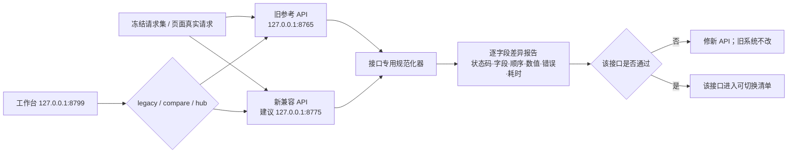

# 微信关键词迁移计划 v1.0

> **状态**：待用户审阅批准；本文只制定方案，不执行停机、备份、迁移、抓取或代码修改。
> **编制日期**：2026-07-16。
> **现行架构依据**：[`全域内容资产与观测架构方案_v3.3.md`](../全域内容资产与观测架构方案_v3.3.md)。
> **数据语义参考**：[`全域内容资产与观测架构方案_v3.2.md`](../全域内容资产与观测架构方案_v3.2.md)。
> **总验收依据**：[`全域内容工作台验收矩阵_v2.md`](../全域内容工作台验收矩阵_v2.md)，尤其是 T041–T075。
> **一句话目标**：**旧系统冻结后作为“标准答案”，新系统在另一端口按原 `/api/...` 契约逐接口还原；同一批请求同时跑新旧两套并逐字段比较，全部通过后只切换工作台上游，微信前端不改版。**

---

## 0. 先说大白话结论

这次迁移不重做微信页面，也不要求一次把所有旧代码翻新。核心只有三件东西：

1. **一份冻结备份**：先停止抓取和调度，把旧系统在某一时刻完整定格，确保后面比较时“标准答案”不会继续变化。
2. **一份自动差异报告**：同一个请求同时发给旧 API 和新 API，比较状态码、字段、排序、数字、错误和落盘结果。
3. **一个上游切换开关**：工作台始终使用原来的 `/api/...`，最终只把数据来源从 `legacy` 切到 `hub`；出问题立即切回。

> **这套方法本身是正确的。真正的难点不在“接口有多少”，而在于必须把旧系统隐藏在接口背后的排序、时间、去重、动态观测、算法、错误和任务状态完整演回来。**

本计划选择的路线是：

```text
暂停抓取
  → 冻结旧系统
  → 完整备份并恢复演练
  → 全量导入新数据底座
  → 新旧双端口启动
  → 读取接口逐项影子比较
  → 写接口在隔离副本中比较
  → 页面按原操作验收
  → 一次切换工作台上游
  → 保持抓取暂停，观察稳定
  → 单关键词受控刷新
  → 小批刷新
  → 恢复正式调度
```

这里的“逐接口”是为了容易查错，不代表用户要长期同时维护两套产品。**最终仍然是一次把微信模块整体切到新底座。**

---

## 1. 范围、目标与明确不做

### 1.1 本计划包含

- 微信关键词旧系统的历史 Markdown、SQLite、JSON、任务状态和派生数据冻结；
- 原系统完整备份、哈希清单和隔离恢复演练；
- 搜索结果、文章正文、动态指标、关键词设置、调度和任务状态迁入 v3.3 底座；
- 保持原 `/api/...` 请求和响应结构的兼容 API；
- 旧服务、新兼容服务、统一工作台三端口并行；
- 旧、新接口的逐请求、逐字段、逐落盘差异比较；
- 原版主页面、辅助详情页和原操作的完整验收；
- 最终切换、观察、抓取恢复和一键回退。

### 1.2 本计划明确不做

- 不重新设计微信关键词前端；
- 不改变四个原视角、列表密度、筛选、排序、图表、弹窗、抽屉和操作顺序；
- 不借迁移之名重写或“优化”旧算法；
- 不把当前看起来重复的动态观测直接删除；
- 不修改旧系统源码、旧 Markdown 和原始历史；
- 不把阅读量、点赞、在看、排名等动态值写回正文 Frontmatter；
- 不在影子阶段执行两次真实抓取、两次真实 Aidso 查询或两次其他外部副作用；
- 不在备份和恢复演练通过前启动迁移；
- 不在 T041–T075 未全部通过前宣称微信模块已完成。

### 1.3 “前端不变”的准确含义

**前端不改版，不等于可以遗漏原页面。**当前工作台已镜像主监控页，但旧系统还存在：

- `/keyword-turnover`
- `/article-hit-detail`
- `/article-hit-detail-demo`
- `/account-score-analysis`
- `/account-score-formula`

其中主页面会直接跳转 `/keyword-turnover` 和 `/article-hit-detail`。因此迁移前必须把原辅助页面、脚本和路由原样补齐。这属于**补完整原前端**，不是重新设计前端；DOM、样式、字段和操作不得擅自改动。

---

## 2. 已核实的当前事实基线

### 2.1 运行与端口

| 角色 | 地址 | 迁移期间职责 |
|---|---|---|
| 旧微信服务 | `127.0.0.1:8765` | 冻结后的标准答案，仅供读取和比较 |
| 新兼容 API | 建议 `127.0.0.1:8775` | 从新 Hub/运行库还原旧 `/api/...` 契约；执行前检查端口占用 |
| 统一工作台 | `127.0.0.1:8799` | 保持原微信业务岛屿；通过开关选择 `legacy/compare/hub` |

### 2.2 当前旧数据规模

以下是 2026-07-16 盘点时从旧系统真实目录和 `normalized/` 文件读取的数量；**冻结日必须重算，冻结清单中的数字才是最终验收基准。**

| 数据 | 当前盘点值 |
|---|---:|
| 批量抓取目录 Markdown | 60,912 |
| 搜索快照 `snapshots.json` | 10,191 |
| 排名命中 `ranking_hits.json` | 101,348 |
| 下拉词/关联词 `snapshot_terms.json` | 174,055 |
| 文章 `articles.json` | 6,364 |
| 文章指标观测 | 38,909 |
| 文章账号候选 `accounts.json` | 2,143 |
| 主页面关键词 | 312 |
| 主页面账号 | 1,361 |
| 关键词注册表 | 457 |
| 关键词分组 | 18 |
| 当前 `monitor-data.json` 生成时间 | `2026-07-15T21:33:51` |

旧项目当前约 3.1 GB。`monitor-data.json` 约 182 MB，因此新接口不能每次请求都重新解析整份大 JSON。

### 2.3 当前接口和工作台状态

- 旧后端有 **42 条路由声明、43 个 HTTP 方法操作**：
  - GET 22 个；
  - POST 14 个；
  - PATCH 5 个；
  - DELETE 2 个。
- 工作台当前已能代理旧系统读取接口；
- 工作台当前会阻断原业务岛屿的 POST/PATCH/DELETE，避免直接改旧系统；
- 新 `/api/v1/wechat/...` 目前只覆盖少量 Hub 能力，**尚未完整还原下文 43 个旧操作**；
- 当前 `compare` 基础能力主要比较整份 JSON 哈希，正式影子验收必须升级为**接口专用规范化 + 逐字段差异**，否则只能知道“不同”，不知道“哪里不同”。

---

## 3. Markdown、数据库和派生结果怎么分工

### 3.1 三类 Markdown

| 类型 | 新系统处理 | 权威位置 |
|---|---|---|
| 搜索结果 Markdown | 原文件只读保留；解析为关键词、快照、排名、文章命中、下拉词和关联词 | SQLite 中的搜索事实 |
| 文章正文 Markdown | 按稳定身份和正文哈希去重；新资产目录只保留一份标准正文；旧路径保留来源关系 | Markdown 正文资产 |
| 报告、简报、汇总 Markdown | 视为数据库投影，可重新生成，不作为排名和指标事实源 | SQLite + 可重建报告 |

### 3.2 Frontmatter 只保存稳定身份

标准正文 Frontmatter 建议只包含：

```yaml
schema_version: "content-md/1.1"
content_id: "..."
content_type: "external_article"
title: "..."
canonical_url: "..."
published_at: "..."
author: "..."
```

以下动态数据不得写入 Frontmatter：

- 阅读量、点赞、在看；
- 当前排名、历史排名、命中次数；
- 今日增量、趋势、置信度；
- 刷新状态、任务进度；
- 关键词分组、置顶、商业价值等运行状态。

`creator_id`、`content_hash`、原始文件路径和全部 `source_ref` 由 SQLite 保存，避免 Frontmatter 变成第二套数据库或不断增长的来源数组。

### 3.3 旧数据到新底座的映射

| 旧来源 | 新位置 | 规则 |
|---|---|---|
| `snapshots.json` | `search_snapshots` | 一个关键词在一个采集时刻形成一个快照；时间统一为明确时区的 ISO 8601 |
| `ranking_hits.json` | `search_hits` + `content_discoveries` | 排名严格保留；身份未解析也保留原始标题、URL、账号 |
| `snapshot_terms.json` | `search_snapshots.features_json`，必要时增加微信模块索引表 | 下拉词、关联词、信号词保持类型和原顺序，不混为一个词袋 |
| `articles.json` | `contents`、`content_identifiers`、`creators` | 规范 URL/微信外部 ID 优先；旧 `article_id` 作为兼容标识保留 |
| 正文 Markdown | `asset_store/content/...` | 标准正文按内容身份去重；原文件不删除、不覆盖 |
| 文章指标观测 | `metric_definitions`、`metric_observations` | 每次观测追加，禁止用“最新值”覆盖历史 |
| `keyword_read_deltas.json` | `metric_observations` + 模型元数据 | 保留估算值、原始值、置信度、趋势和模型版本 |
| `account_aliases.json` | 创作者标识/别名运行表 | 规范账号与原别名均可追溯 |
| `penalty_signals.json` | `signals` + 模型证据 | 保留基线、事件、惩罚表和模型版本 |
| `data/state/app.db` 的 group/registry | 搜索模块运行表 | 分组、备注、置顶、刷新策略、商业价值、归档锁不塞进 14 张核心表 |
| 刷新 job、batch、ledger、runs | `search_refresh_jobs/items`、`job_events`、`audit_log` | 任务可重启、可取消、可解释 |
| `scheduler.json` | `search_scheduler_state` | enabled、间隔、预算、上下次时间完整迁移 |
| Agent 产物 | 从 Hub/运行库重新生成 | 产物可重建，证据引用必须可回到原始批次 |

### 3.4 身份与重复处理

身份解析优先级：

1. 微信稳定外部 ID；
2. 规范化 canonical URL；
3. 公众号账号 ID + 文章 ID；
4. 完整正文哈希；
5. 标题、作者、发布时间、正文相似度只产生人工候选。

禁止仅因标题相同自动合并。每个旧 `article_id`、旧文件路径和搜索命中都必须能映射到：

- 新 `content_id`；或
- 明确的未解析记录；或
- 有证据的人工合并候选。

> 去重允许让“标准正文文件数”下降，但不允许让历史快照、排名命中、来源路径和动态观测消失。

---

## 4. 阶段一：暂停抓取与冻结旧系统

### 4.1 冻结顺序

1. 记录冻结操作者、开始时间、旧服务版本和当前端口；
2. 禁用旧 scheduler；
3. 停止 watchdog、守护批跑、定时脚本和系统级计划任务；
4. 检查单关键词刷新、批量刷新、Aidso、重建脚本是否仍在运行；
5. 有活动任务时，选择“等待完成”或“受控取消”，不得直接杀进程后假定完成；
6. 记录最后成功批次、最后快照时间、活动/取消任务状态；
7. 关闭旧系统所有写入口，只保留冻结参考实例的 GET/HEAD；
8. 连续观察原始目录、`normalized/`、`app.db`、任务目录和 scheduler 状态；
9. 达到稳定条件后写入唯一 `freeze_id` 和 `freeze_at`。

### 4.2 冻结通过标准

- scheduler 明确为 disabled；
- 无 running/queued/cancelling 的单词或批量刷新；
- 无仍在写文件的抓取、重建和 watchdog 进程；
- `app.db` 完成 checkpoint 后状态稳定；
- 关键目录在连续 15 分钟观察窗口内无新增、删除和内容变化；
- 同一组核心 GET 请求连续执行两次，业务字段和 ETag/内容哈希稳定；
- 冻结报告记录“最后一个已接收的事实”与“第一个禁止写入的时刻”；
- 冻结后任何意外写入都视为 P0，废弃本次冻结并重新开始。

### 4.3 冻结期间的用户体验

- 工作台微信页面可以继续读取冻结数据；
- 刷新、调度、Aidso 和设置写入必须返回真实“迁移冻结中”状态；
- 不显示假成功 Toast；
- 旧 `8765` 参考实例不作为用户正常操作入口，只作为比较标准答案。

---

## 5. 阶段二：完整备份与恢复演练

### 5.1 必须备份的内容

| 备份对象 | 方法 | 验证 |
|---|---|---|
| `data/state/app.db` | SQLite Online Backup；不得直接复制正在写的主文件 | `PRAGMA integrity_check`、表和行数 |
| `normalized/` 全部 JSON | 文件级复制 + SHA-256 manifest | 文件数、大小、哈希、JSON 可解析 |
| 搜索结果和文章 Markdown | 只读归档或文件系统快照 | 文件数、总大小、逐文件哈希 |
| `data/runs`、refresh jobs、ledger、scheduler | 文件级复制 | 状态文件可解析、批次关系完整 |
| Agent、别名、惩罚、Aidso 等产物 | 文件级复制 | 哈希和引用路径 |
| 旧前后端源码和配置模板 | 源码快照 + hash | 路由、页面、脚本可定位 |
| 运行环境说明 | 版本、端口、启动方式、依赖清单 | 可在隔离目录启动参考实例 |
| 敏感本机配置 | 单独本机加密保存，不进入 Git、报告和 API | 只记录“已备份/未备份”，不记录秘密值 |

### 5.2 备份产物

每次冻结只生成一套不可混淆的产物：

```text
data/migration/wechat/{freeze_id}/
├── freeze-report.json
├── file-manifest.jsonl
├── api-baseline/
├── counts.json
├── source-hashes.json
├── sqlite/
├── normalized/
├── runtime-state/
└── restore-drill-report.md
```

实际大数据目录不得提交 Git；Git 只保存脱敏后的计划、Schema、统计摘要和证据索引。

### 5.3 恢复演练

恢复演练必须在隔离目录完成，绝不覆盖运行库：

1. 恢复 SQLite；
2. 校验完整性和关键表行数；
3. 校验 JSON 全部可解析；
4. 随机抽取搜索快照、文章正文、指标观测和任务状态；
5. 从备份启动旧参考实例；
6. 调用核心 API 并与冻结时保存的响应哈希比较；
7. 关闭恢复实例并保留报告。

### 5.4 备份门禁

以下任一失败，不进入迁移：

- 数据库完整性失败；
- 文件哈希不一致；
- 随机正文无法打开；
- 原快照无法回放；
- 恢复实例的核心 API 与冻结基线不一致；
- 备份清单缺失来源、时间、数量或哈希；
- 发现 Cookie、Token、Profile 等秘密进入 Git 产物。

---

## 6. 阶段三：新数据底座全量导入

### 6.1 导入顺序

```text
关键词/分组/设置
  → 创作者
  → 内容身份与旧 ID 映射
  → 正文资产
  → 搜索快照
  → 排名命中与发现关系
  → 下拉词/关联词/信号词
  → 文章动态指标
  → 关键词阅读估算与模型元数据
  → 别名、惩罚、发现候选
  → 刷新任务、历史、调度状态
  → Agent 投影和证据索引
```

### 6.2 导入规则

- 先 dry-run，输出预计新增、复用、拒绝和冲突；
- 每类数据独立 batch，拥有 manifest、checkpoint 和错误清单；
- 同一 freeze 重放必须幂等，不新增重复事实；
- 所有 SQL 参数化，写入经进程级单写锁；
- 任一批次失败不得留下“半个快照”或“有 hit 无 snapshot”的状态；
- 旧数据不能因为新 Schema 缺字段而丢弃，暂时无法标准化的字段进入经过 Schema 校验的兼容载荷；
- 导入只读取冻结备份，不直接读取仍可能被误启动的旧运行目录；
- 全量导入完成后再次执行一次同 manifest 重放，证明幂等。

### 6.3 数据导入验收

| 项目 | 通过标准 |
|---|---|
| 快照 | 冻结源中的每个快照都成功导入或有明确拒绝证据；关键词、时间和来源可回放 |
| 排名 | 每个 hit 的 snapshot、rank、原始标题、URL、账号可查询；排名顺序不漂移 |
| 词特征 | 下拉词、关联词、信号词的类型、顺序、出现快照和数量可复核 |
| 文章 | 每条旧 article 有新身份映射；去重不丢旧 ID、路径和发现关系 |
| 正文 | 标准 Markdown 可打开，图片相对路径有效，原文哈希可追溯 |
| 指标 | 每条观测按时间追加；同时间多来源不互相覆盖；最新值可由历史推导 |
| 设置 | 分组、备注、置顶、刷新策略、商业价值、归档锁完整 |
| 任务 | 批次、明细、成功、失败、取消、错误和时间线完整 |
| 调度 | enabled、间隔、预算、next/last run 语义一致 |
| 幂等 | 第二次完整重放新增核心事实为 0；只允许更新导入审计时间 |
| 来源 | 任一抽样记录可通过 `source_ref` 回到冻结备份中的真实文件或数据库行 |

数量不要求简单地“新表行数等于旧文件行数”，因为内容会去重；但必须满足：

```text
旧来源记录数
= 新建记录数
+ 复用/合并映射数
+ 有证据的拒绝数
```

等式任何一项对不上，禁止进入 API 切换。

---

## 7. 阶段四：双端口影子比较

### 7.1 运行结构



### 7.2 三种模式

| 模式 | 页面拿到什么 | 后台做什么 | 用途 |
|---|---|---|---|
| `legacy` | 旧 API 响应 | 不调用新 API或只离线回放 | 现状和紧急回退 |
| `compare` | **仍返回旧 API 响应** | 同请求调用新 API，记录差异；新失败不能污染页面 | 安全影子验收 |
| `hub` | 新 API 响应 | 可选后台抽样调用旧 API | 正式接管 |

### 7.3 读取和写入不能用同一种比较方法

**GET/HEAD 读取接口**可以对同一冻结数据直接调用两边。

**POST/PATCH/DELETE 写接口**不能对真实生产状态各执行一次，否则会产生双重副作用。写接口采用：

```text
旧冻结库的测试副本 A
新运行库的测试副本 B
  → 设置相同初始状态
  → 执行相同请求
  → 比较 HTTP 回执
  → 比较数据库/文件/任务事件变化
  → 重启服务后再读一次
```

刷新、Aidso、scheduler trigger 等外部动作必须使用：

- 模拟 Provider；
- 固定响应录制；
- dry-run；
- 或用户批准的极小受控样本。

不得对同一真实关键词同时触发旧抓取和新抓取。

### 7.4 每份差异报告至少包含

- `freeze_id`；
- 接口、方法、查询参数和脱敏请求体；
- 请求样本 ID；
- 旧/新状态码、Content-Type 和关键缓存头；
- 旧/新规范化后哈希；
- JSON Pointer 级字段差异；
- 数组增删、排序变化；
- 数值差、允许容差和容差依据；
- 旧/新耗时和响应大小；
- 错误类型与错误信息差异；
- 写接口前后状态差异；
- 结论：`matched/different/legacy_error/hub_error/approved_exception`；
- 修复版本和复测结果。

---

## 8. 通用比较规则

### 8.1 默认严格相等

以下内容必须严格相等：

- HTTP 状态码；
- 字段是否存在及字段类型；
- 业务 ID、旧兼容 ID；
- 关键词、账号、文章集合；
- 排名和可见数组顺序；
- 分组顺序、置顶顺序、文章排序和分页；
- 枚举、布尔值、错误码；
- 搜索快照时间、发布时间和观测时间所代表的实际时刻；
- 任务状态机和状态转换顺序；
- 数据库/文件副作用；
- 原正文内容和路径安全行为。

### 8.2 只允许书面登记的规范化

允许的技术规范化：

- JSON 对象键顺序；
- `1` 与 `1.0` 在字段明确为数值时等价；
- 不同时区表示但代表同一瞬间的 ISO 时间；
- 明确声明为“无序集合”的数组可按业务键排序；
- 请求级 `compared_at/request_id` 等新审计字段可排除。

默认不允许：

- 把字段缺失和 `null` 当成相同；
- 把 `null`、空字符串、0 当成相同；
- 随意 trim 业务文本；
- 为了通过而重新排序页面可见数组；
- 忽略未知字段；
- 给算法结果设置宽泛百分比容差。

浮点规则：

- 存储和算法中间值默认绝对误差 `≤ 1e-6`；
- 页面展示到两位小数的字段，展示值必须完全相同；
- 如果旧算法本身含随机或外部波动，必须固定输入、模型版本和录制响应后再比较。

### 8.3 差异分级

| 级别 | 示例 | 处理 |
|---|---|---|
| P0 | 缺字段、类型变化、ID/排名/数量错误、写入错误、任务假成功、路径越界 | 立即停止该接口切换 |
| P1 | 分数、趋势、阅读估算、筛选、排序、详情内容不同 | 修复并全量重跑 |
| P2 | 经确认不影响业务的请求时间、无序集合顺序、额外审计字段 | 必须书面登记后才可批准例外 |

**用户可见差异不允许以 P2 放行。**

---

## 9. 完整读取接口清单与验收值

| # | 接口 | 新系统主要来源 | 必须比较的核心内容 | 阶段 |
|---:|---|---|---|---|
| R01 | `GET /api/monitor-data` | Hub + 微信运行库完整投影 | 全量字段、关键词/账号/快照闭包、gzip/ETag/304、404 语义；不得每次解析 182 MB 源 JSON | R4 |
| R02 | `GET /api/monitor-data/bootstrap` | Hub 摘要投影 | `generated_at/window_days/window_start/window_end`、评分/估算元数据、bucket options、scope/total/pinned、关键词和账号 ID 集合、顺序、摘要字段 | R1 |
| R03 | `GET /api/monitor-data/keyword/{keyword_id}` | keyword + snapshots + hits + observations + settings | 身份、topic/bucket、today_best/count、coverage、账号/文章数、latest_run、完整 runs、排名、terms、history、heat、分数、置顶、`keyword_read_delta` 全部模型字段 | R1 |
| R04 | `GET /api/monitor-data/account/{account_id}` | creator + discoveries + hits + metrics +评分投影 | 身份/头像、三类分数及昨日/delta/level、三套 hexagon/parts/解释、history/day/raw scores、主题/关键词/文章/覆盖、move summary、嵌套详情、今日文章集合 | R1 |
| R05 | `GET /api/agent/manifest` | Hub manifest 投影 | schema/projection 版本、数据截至、批次、计数、hash、证据入口 | R4 |
| R06 | `GET /api/agent/daily-brief` | Hub 视图 + signals | 摘要、重点关键词/账号/文章、异常、数据窗口、证据 ID；同冻结输入输出一致 | R4 |
| R07 | `GET /api/agent/metric-dictionary` | `metric_definitions` | metric key、平台、主体、显示名、单位、累计性、解释、模型版本 | R3 |
| R08 | `GET /api/agent/evidence/{evidence_id}` | source_ref/manifest/证据索引 | 合法 ID 内容、hash、来源；非法 ID 400、缺失 404；禁止路径穿越 | R3 |
| R09 | `GET /api/penalty-signals` | `signals` + 惩罚模型投影 | events、penalty table、baseline、差分词、阈值、模型版本、时间窗口 | R3 |
| R10 | `GET /api/account-aliases` | creators + identifiers + alias runtime | aliases、groups、canonical account、score impact、来源证据 | R3 |
| R11 | `GET /api/article-content?path=...` | Markdown 资产 Repository | 原 Markdown 正文、受控相对路径、编码；非法路径 400、缺失 404、软链接/越界拒绝 | R1 |
| R12 | `GET /api/article-hit-detail?article_id=...&url=...` | contents + discoveries + hits + metrics | article/account/url profile、content files、命中/关键词数、cloud/groups、metric points、timeline events | R1 |
| R13 | `GET /api/article-cover-image?url=...` | 安全图片代理/缓存 | 成功状态、Content-Type、可解码图片、尺寸/稳定源 hash、Cache-Control；非法 URL 400，上游失败 502 | R3 |
| R14 | `GET /api/aidso/keyword-heat?...` | 录制响应或受控 Provider | keyword、热度值、时间、来源、登录/忙碌/上游错误 400/409/502；真实外部结果不做双调用 | R5 |
| R15 | `GET /api/keyword-manage` | 搜索运行库 | 18 分组及顺序、每组关键词 ID/名称/备注/默认选择、刷新策略/状态/时间、商业价值、生命周期、锁、today/coverage/accounts/articles、总计 | R1 |
| R16 | `GET /api/keyword-discovery?...` | discovery probes/candidates/evidence 运行表 | `summary/probes/candidates`、状态筛选、limit、证据、推荐词、去重状态 | R3 |
| R17 | `GET /api/refresh-status/{job_id}` | refresh jobs/items/events | job ID、状态、当前阶段、进度、结果、错误、开始/结束时间；不存在 404 | R2 |
| R18 | `GET /api/refresh-all/status?batch_id=...` | batch + items + events | active/idle、批次、当前词、完成/失败/总数、取消、错误；指定批次不存在 404 | R2 |
| R19 | `GET /api/refresh-all/history` | refresh jobs/items/events | 批次顺序、参数、来源、成功失败取消、明细、错误和时间 | R2 |
| R20 | `GET /api/scheduler/status` | scheduler state + refresh plan | enabled、interval、预算、max batch、next/last、plan/discovery、最近错误 | R2 |
| R21 | `GET /api/articles?...` | contents + hits + metrics + creator scores | total/page/page_size、文章顺序、ID/标题/URL/账号、read/like、hit/on-rank、score、发布时间、path/cover；7 种排序与全部筛选分页组合 | R1 |
| R22 | `GET /api/articles/accounts` | creators + article aggregation | 账号候选、文章数、顺序、去重；冻结基线当前为 2,143 个候选 | R1 |

### 9.1 核心读取覆盖量

读取接口不能只抽几个样本：

- R02：完整比较全部 312 个关键词摘要和 1,361 个页面账号摘要；
- R03：遍历全部 312 个关键词 ID；
- R04：遍历全部 1,361 个页面账号 ID，并补测不存在 ID；
- R11/R12：覆盖全部 6,364 篇文章的身份闭包；正文至少全量做路径/hash 校验；
- R15：完整比较 18 个分组和 457 个注册关键词；
- R21：分页遍历全量文章，并覆盖：
  - `reads`
  - `onRankDays`
  - `hitCount`
  - `publishTime`
  - `likes`
  - `accountScore`
  - `todayReads`
  - 时间范围、命中阈值、账号、标题搜索、分页的组合；
- 所有接口都要覆盖正常、空结果、非法参数、缺失 ID 和上游错误。

---

## 10. 完整写入/外部动作接口清单与验收值

| # | 接口 | 作用 | 比较方式与通过标准 | 阶段 |
|---:|---|---|---|---|
| W01 | `POST /api/article-covers` | 批量解析文章封面 | 固定文章集；比较输入校验、每项 cover、错误、顺序和部分失败；不得产生重复下载或秘密泄露 | W3 |
| W02 | `POST /api/keywords/{id}/pin` | 置顶 | 隔离副本执行；比较状态码、响应、置顶顺序、持久化、重复点击幂等、缺 keyword 400 | W1 |
| W03 | `POST /api/keywords/{id}/unpin` | 取消置顶 | 比较取消后顺序、重复取消、刷新页面和重启后状态 | W1 |
| W04 | `POST /api/keywords/{id}/topic` | 修改 topic | 比较 null/空值、trim 规则、列表与详情同步、重启持久化 | W1 |
| W05 | `POST /api/keywords/{id}/note` | 修改备注 | 比较原文保存、空备注、Unicode、刷新后持久化、审计 | W1 |
| W06 | `POST /api/keywords/{id}/bucket` | 修改 bucket | 比较 bucket 值、未分组语义、列表/详情/管理页同步 | W1 |
| W07 | `POST /api/aidso/keyword-heat` | 真实热度查询 | 不双调真实服务；使用录制响应/模拟 Provider；比较请求参数、登录/忙碌/超时/502、结果落盘和模型时间 | W4 |
| W08 | `POST /api/keyword-manage/groups` | 新建分组 | 比较必填、重名、group ID、order、持久化、审计 | W1 |
| W09 | `PATCH /api/keyword-manage/groups/{id}` | 改名/排序 | 比较 label/order、404/400、关键词归属不丢失、重启持久化 | W1 |
| W10 | `DELETE /api/keyword-manage/groups/{id}` | 删除分组 | 比较确认前置、非空组规则、孤儿处理、404/400、审计 | W1 |
| W11 | `POST /api/keyword-manage/keywords` | 新增关键词 | 比较 group/keyword/note、去重、默认设置、新增数量、400/404、审计 | W1 |
| W12 | `PATCH /api/keyword-manage/keywords/{id}` | 改名/备注/移动组 | 比较三个字段组合、列表/详情同步、冲突、404/400、持久化 | W1 |
| W13 | `DELETE /api/keyword-manage/keywords/{id}` | 删除/归档关键词 | 比较删除语义、历史事实保留、列表可见性、404、审计和恢复路径 | W1 |
| W14 | `PATCH /api/keyword-manage/keywords/{id}/refresh-policy` | 刷新频率 | 比较 days/source、自动/人工语义、非法值 400、next run 重算 | W1 |
| W15 | `PATCH /api/keyword-manage/keywords/{id}/commercial-value` | 商业价值 | 比较 score/reason、范围校验、列表/详情同步、模型字段不被覆盖 | W1 |
| W16 | `PATCH /api/keyword-manage/keywords/{id}/auto-archive-lock` | 自动归档锁 | 比较 bool 转换、锁状态、重复请求、404、持久化 | W1 |
| W17 | `POST /api/keywords/{id}/refresh` | 单关键词刷新 | 模拟/受控样本；比较 200/202/409、幂等键、持久 job、进度、快照写入、失败、重启恢复和审计 | W2 |
| W18 | `POST /api/refresh-all/cancel` | 取消批次 | 比较缺 batch 400、不存在 404、已结束返回、cancelling、当前项完成后停止、已完成项保留 | W2 |
| W19 | `POST /api/refresh-all` | 批量刷新 | 比较 keyword_ids 去重/非法项、incremental、running 冲突 409、202、进度、失败、取消、恢复和最终快照 | W2 |
| W20 | `POST /api/scheduler/config` | 修改调度 | 比较 enabled/interval/budget/max batch、非法值、next run、持久化和审计 | W2 |
| W21 | `POST /api/scheduler/trigger` | 立即调度 | 模拟 Provider；比较忽略 enabled 的旧语义、批次创建、冲突、任务链、审计；正式冻结期禁止真实触发 | W2 |

### 10.1 写接口统一验收

每个写接口至少测试：

- 正常请求；
- 缺失必填字段；
- 非法类型/范围；
- 不存在 ID；
- 重复点击；
- 幂等键重复；
- 并发两次请求；
- 服务在写入中途异常；
- 重启后状态；
- 审计日志；
- 页面刷新后读回；
- 回退时的命令日志可重放。

---

## 11. API 实施顺序

| 波次 | 内容 | 完成门槛 |
|---|---|---|
| P0 | 冻结契约、请求样本、错误样本、页面路由、字段 Schema | 43 个操作均有契约和基线 |
| R1 | bootstrap、keyword、account、keyword-manage、articles、article detail/content | 原四视角和文章详情可完整只读运行 |
| R2 | refresh status/history、scheduler status | 旧任务历史和状态页完整展示 |
| R3 | aliases、penalty、discovery、metric dictionary/evidence、covers | 辅助分析和解释链完整 |
| R4 | full monitor-data、Agent manifest/daily brief | 全量兼容和 Agent 投影完整 |
| R5 | Aidso GET 等外部读取 | 固定响应和真实错误语义通过 |
| W1 | 分组、关键词、topic/bucket/note/pin、商业设置 | 可逆运行状态写入完整 |
| W2 | 单词刷新、批量刷新、取消、scheduler | 持久任务、幂等、恢复和审计完整 |
| W3 | 批量封面 | 外部资源和部分失败可控 |
| W4 | Aidso POST | 用户批准的受控外部链路 |

每一波遵循：

```text
实现新 API
  → 契约单测
  → 冻结请求集全量比较
  → 修复全部差异
  → 页面真实操作
  → 该波进入可切换清单
```

不能因为后续接口未完成而修改已经冻结的旧契约；需要新增字段时，只能作为兼容扩展且不得破坏旧页面。

---

## 12. 页面和业务验收

页面不改版，但必须证明原操作全部由新底座支撑。最终按 T041–T075 执行，重点归纳如下：

### 12.1 四个原视角

- 关键词视角；
- 账号透视；
- 关键词管理；
- 文章 List。

### 12.2 关键词链路

- 搜索、清空、分组、更多分组、状态筛选；
- 默认、常态阅读、阅读增量、趋势排序；
- 置顶/取消置顶；
- topic、bucket、备注和类目；
- 快照切换、排名时间线；
- 上榜数、覆盖天数、快照数；
- 阅读估算、置信度、趋势和解释；
- 关联词、下拉词、信号词；
- 发现词添加监控；
- 单词刷新、批量选择、批量刷新、停止和历史。

### 12.3 账号链路

- 账号分、时效榜、当天榜；
- 账号列表、详情、历史/近期覆盖和文章命中；
- 别名归一、评分公式和解释页面。

### 12.4 管理链路

- 批量添加；
- 添加并刷新；
- 新建、改名、排序、删除分组；
- 编辑关键词名称、topic、bucket、备注和归属；
- 修改刷新策略、商业价值和自动归档锁；
- 立即刷新、归档和恢复路径。

### 12.5 文章链路

- 7 种排序；
- 时间、命中阈值、多账号、标题搜索组合筛选；
- 分页和总数；
- 文章详情；
- Markdown 正文；
- 封面；
- 命中详情、快照、指标和链接。

### 12.6 页面通过标准

- 原系统截图、新工作台截图和实际点击证据齐全；
- 同一操作在 `legacy/compare/hub` 下页面契约不变；
- `compare` 模式即使新接口失败，页面仍显示旧结果并记录真实差异；
- `hub` 模式页面所有字段、排序和操作与旧系统一致；
- 辅助详情页不落入工作台 React catch-all；
- 写操作不能只靠 Toast，必须有 API、数据库/文件和审计证据；
- 空态、错误态、离线态和冻结态真实，不伪造正常数据。

---

## 13. 最终切换门禁

只有同时满足以下条件，才允许从 `compare` 切到 `hub`：

### 13.1 数据门禁

- 冻结备份和恢复演练 PASS；
- 全量导入和第二次幂等重放 PASS；
- 快照、hit、terms、文章、指标、设置、任务等来源记录全部有去向；
- 零孤立 snapshot/hit/content/observation；
- 零无法解释的身份一对多；
- 正文、图片路径和 source_ref 抽查及全量完整性检查通过；
- 新 Hub 再做一次在线备份和恢复演练。

### 13.2 接口门禁

- 43 个旧操作全部有实现、契约和测试；
- R1/R2/W1/W2 全部零未解释差异；
- 其他接口零用户可见差异；
- 全部错误状态和边界条件通过；
- 核心 GET 全量遍历通过，不只抽样；
- 写接口在隔离副本中的前后状态和重启状态通过；
- 接口 p95 不高于冻结旧基线的 120%，且页面无超时和内存持续增长；
- `/api/monitor-data` 不以每请求重读 182 MB JSON 的方式实现。

### 13.3 页面门禁

- T041–T075 全部 PASS；
- 主页面和五个辅助路由完整；
- 原四视角、详情、筛选、排序、分页、弹窗、抽屉和任务流程完整；
- 1440×1000、1440×900、1280×720、1920×1080 核心操作可达；
- `legacy → compare → hub → legacy` 回退演练完成。

### 13.4 风险门禁

- 零已知 P0/P1；
- 无活动旧抓取任务；
- 无秘密进入 Git/API/日志；
- 回退开关、回退操作者和回退步骤已现场演练；
- 切换窗口内禁止其他系统同时进行重大数据迁移。

---

## 14. 切换当天 Runbook

### 14.1 切换前

1. 再次确认旧抓取和 scheduler 停止；
2. 对旧冻结数据做最终增量哈希检查；
3. 对新 Hub 做在线备份；
4. 执行核心接口全量 compare；
5. 执行微信页面完整冒烟；
6. 确认回退开关当前为 `legacy`，并记录操作者。

### 14.2 正式切换

1. 短暂阻断微信写操作；
2. 把微信全部已验收 contract 从 `compare` 原子切到 `hub`；
3. 清理工作台 API 缓存和旧 ETag 缓存；
4. 重启或热加载工作台 BFF；
5. 立即执行：
   - bootstrap；
   - 3 个不同类型关键词详情；
   - 3 个不同账号详情；
   - 文章 List 7 种排序；
   - 文章详情和正文；
   - keyword-manage；
   - refresh/scheduler 状态；
6. 用内置浏览器执行四视角、详情页和一个可逆设置写入；
7. 确认数据库、审计和页面读回一致；
8. 解除普通设置写入。

### 14.3 切换后先不恢复全量抓取

**数据和 API 可以一次切换，但抓取恢复必须分三级：**

1. 观察期：scheduler 继续关闭，只读和设置写入运行；
2. 受控单词：用户批准后刷新 1 个低风险关键词；
3. 小批次：选择 5–10 个关键词验证批量、取消、失败和增量导入；
4. 全量：前三级无 P0/P1 后才恢复正式 scheduler 和预算。

这不是慢慢迁移数据，而是防止“新 API 正确，但新抓取任务把数据写坏”。

### 14.4 观察窗口

| 时间 | 重点 |
|---|---|
| 切换后 0–2 小时 | 错误率、页面空白、字段缺失、排序、写入、锁、内存 |
| 2–24 小时 | 全页面使用、审计、缓存、重启、备份、回退准备 |
| 单词刷新后 | 新 raw、snapshot、hit、metrics、任务事件、页面增量 |
| 小批刷新后 | 并发、取消、失败、重复、调度预算和对账 |
| 恢复 scheduler 后 7 天 | 每日差异报告、缺采集、指标倒退、身份冲突和性能 |

---

## 15. 回退方案

### 15.1 一键回退

回退只改工作台上游，不改前端：

```text
wechat contracts: hub/compare → legacy
  → 停止新 refresh/scheduler
  → 清理 BFF 缓存
  → 页面重新读取旧冻结参考数据
```

目标是 5 分钟内恢复到冻结时的可用状态。

### 15.2 必须立即回退的条件

- bootstrap、keyword、account、articles 任一核心接口连续失败；
- 页面出现大面积空白、错位数据或错误排序；
- 排名、阅读量、文章身份发生不可解释变化；
- 设置写入丢失、写错对象或无法读回；
- refresh 任务假成功、重复抓取、无法取消或重启后状态丢失；
- 数据库完整性、外键、写锁或文件安全异常；
- 出现路径穿越、XSS、秘密泄露；
- P0 差异在切换窗口内无法立即修复。

### 15.3 回退后的新数据怎么处理

- 新系统切换后产生的 raw、Markdown、Hub 观测和任务事件全部保留；
- 回退只让页面暂时读取旧冻结数据，不删除新事实；
- 新产生的数据进入隔离批次，修复后重新对账并重放；
- 若已恢复正式抓取，旧系统会暂时看不到回退后新增事实，但这些事实仍在新 raw/Hub 中，不算数据丢失；
- 禁止为了让旧页面“看起来最新”而手改旧数据库或覆盖旧 Markdown。

### 15.4 回退演练

正式切换前必须至少完成一次：

```text
legacy
  → compare
  → hub
  → 执行读取和一个可逆设置写入
  → legacy
  → 验证旧页面恢复
  → 检查新写入仍有审计和可重放记录
```

---

## 16. 主要风险与处理

| 风险 | 灾难表现 | 预防/处理 |
|---|---|---|
| 冻结不彻底 | 比较时旧答案继续变化，永远对不上 | 停 scheduler/watchdog/任务；15 分钟稳定窗口；任何写入重新冻结 |
| Markdown 重复误删 | 历史路径、快照证据和正文丢失 | 只在新资产层去重；旧文件永久保留；每个旧路径保留映射 |
| 动态指标被覆盖 | 只剩最新阅读量，历史趋势消失 | 所有动态值进入 append-only observations |
| 身份误合并 | 同标题不同文章被当成一篇 | URL/外部 ID 优先；相似度只产生人工候选 |
| 时间和业务日错位 | 今日/昨日、覆盖天数、趋势全部变化 | 固定 Asia/Shanghai 业务时区；比较实际瞬间和 report_date |
| 算法“差不多” | 分数、趋势和排名解释悄悄变化 | 冻结旧输入、模型版本和参数；逐字段比较，不重新发明算法 |
| 数组顺序变化 | 页面排序、选中项和排名错乱 | 页面可见数组严格保序；仅无序集合允许规范化 |
| 写接口被执行两次 | 重复关键词、重复批次、重复外部调用 | 隔离副本比较；真实外部动作只执行一次；幂等键 |
| 任务状态不持久 | 刷新后重启，任务失踪或假完成 | jobs/items/events 持久化；重启恢复和取消测试 |
| 大 JSON 性能问题 | 页面慢、内存暴涨、超时 | Repository 查询、预计算投影、ETag；禁止每请求解析 182 MB |
| 缓存造成旧数据 | 切换后仍看到旧响应 | 版本化 ETag、切换时清缓存、缓存键包含 data_mode |
| 辅助页面缺失 | 点击详情跳到错误页面或白屏 | 原样补齐五个旧页面路由、模板和脚本，列为 P0 |
| 外部封面/Aidso 波动 | 同一请求结果天然不同 | 录制响应/固定缓存；只比较协议和错误；真实调用单边执行 |
| 回退后状态分叉 | 新系统已有新设置，旧冻结系统没有 | 所有命令写审计和可重放日志；软切期间保持抓取关闭 |
| 安全问题 | 路径越界、XSS、秘密泄露 | 路径根限制、软链接拒绝、Markdown 清洗、响应脱敏、秘密扫描 |

---

## 17. 交付物

批准并执行本计划后，微信迁移必须留下：

1. 冻结报告；
2. 旧数据完整备份和 SHA-256 manifest；
3. 隔离恢复演练报告；
4. 旧 43 个操作的契约、请求样本和错误样本；
5. 新数据导入 dry-run、正式导入、幂等重放报告；
6. 旧 ID 到新 ID/正文/来源的映射报告；
7. 每个接口的字段规范化规则；
8. 全量影子差异报告；
9. 写接口隔离副本前后状态报告；
10. T041–T075 浏览器证据包；
11. `legacy/compare/hub` 切换记录；
12. 切换当天日志和观察报告；
13. 单词、小批和正式 scheduler 恢复报告；
14. 回退演练报告；
15. 新 Hub 的切换前、切换后备份。

---

## 18. 完成定义

微信迁移 v1.0 只有满足以下全部条件才算完成：

- 原微信页面未被重新设计，原功能和辅助页面完整；
- 冻结旧数据可恢复、可启动、可作为标准答案；
- 旧 43 个 API 操作在新兼容层全部存在；
- 所有核心读取完成全量逐字段比较；
- 所有写入完成隔离副本、副作用、幂等、重启和审计比较；
- 搜索快照、排名、词特征、正文和动态观测均可追溯；
- `legacy/compare/hub` 可切换且已演练回退；
- T041–T075 全部 PASS；
- 单词和小批刷新真实或受控链路通过；
- scheduler 恢复后连续 7 天无未解决 P0/P1；
- 旧系统和原始历史不删除，旧服务从“生产依赖”降为“只读归档与紧急参考”。

> **最终判断：这不是重新开发一个微信系统，而是把旧系统的“表演结果”逐项还原到新底座。旧系统负责证明答案，新系统负责证明自己能给出同一个答案；前端只在最后换一次数据来源。**
