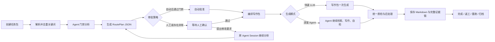

# 批量成稿 Agent 生产台 Demo 规划 v1

最后更新：2026-07-16

> **产品结论**：新版“批量成稿”不再把 Agent 门禁拆成人工逐步操作的 Workflow，而是一个以**任务包、关键词任务、自动化生产和异常复盘**为核心的生产控制台。Agent 自动完成门禁路由、素材选择、写作方案和质检；用户默认只看结果、处理异常，必要时才介入调整。

---

## 1. 本次重做的决定

现有批量成稿 Demo 的业务内容全部废弃，不在旧结构上继续修补。

可以保留的只有：

- 工作台统一外壳；
- 左侧任务列表的整体视觉密度；
- 白底、细边框、轻强调的视觉语言；
- “一个任务包对应一批生产任务”的基本概念。

明确放弃：

- 让用户逐步选择母文章、创作框架、心理积木和钩子的 Workflow；
- 把 Agent 内部门禁代码化为一组必须人工点击的页面步骤；
- “缺母文章就去母文章铸造”的固定业务假设；
- 写死的母文章、热点、钩子和成稿队列 Demo 数据；
- 只展示“等待 / 运行 / 完成”、却无法追溯为什么这样写的黑箱队列。

新版页面的产品定位是：

> **Agent 在后台自动完成决策和生产，前端负责批量调度、异常审批、过程观察、成稿查看和事后复盘。**

---

## 2. 核心业务对象

新版批量成稿只有四层核心对象。

### 2.1 任务包 `TaskPackage`

一次批量生产计划，对应左侧列表中的一项。

一个任务包包含：

- 一批关键词；
- 本批次的统一写作要求；
- 默认审批策略；
- 默认生成模式；
- 输出目录；
- 若干关键词任务；
- 最终生成的全部文章与证据记录。

任务包可以继续保留、暂停、归档、复制或重新生成。归档只改变工作台状态，不删除输出文件和历史证据。

### 2.2 关键词任务 `KeywordTask`

一个关键词就是一个独立任务。

例如：

```text
任务包：7 月 16 日高价值关键词生产
├── 永明心核传承
├── 保诚分红实现率
├── 盛利2提领
└── 港险保费融资
```

每个关键词任务独立拥有：

- 热度和来源信号；
- 计划生成篇数；
- 自动 / 人工审批策略；
- Agent 门禁路由 JSON；
- 推荐生成模式；
- 独立 Agent Session；
- 若干篇文章任务；
- 独立状态、错误和复盘记录。

### 2.3 路由方案 `RoutePlan`

Agent 读取规则和 Wiki 后，在正式写作前输出的结构化 JSON。

它不是文章，而是回答：

- 这个关键词真正对应什么读者问题；
- 应走哪套创作框架；
- 应读取哪些 Wiki 资产；
- 每份素材承担什么作用；
- 使用哪些思维门禁；
- 文章如何开头、推进和破窗；
- 是否有事实不足、冲突或风险；
- 建议快速 LLM 生成还是深度 Agent 生成；
- 是否需要人工确认。

RoutePlan 可以有多个版本。用户调整后，旧版本不覆盖，新版本追加保存。

### 2.4 文章任务 `ArticleRun`

一个关键词可以生成一篇或多篇文章。每篇文章都是一条独立 ArticleRun。

例如关键词“永明心核传承”设置生成 3 篇，系统必须先形成 3 个有明确差异的文章方向，而不是把同一份写作包重复运行 3 次：

1. 产品核心误判与风险测评；
2. 适合人群与家庭现金流判断；
3. 与相邻产品的取舍或隐藏规则。

每篇 ArticleRun 独立记录：

- 文章角度；
- 标题方向；
- 使用素材组合；
- 生成模式；
- 写作包；
- Agent / LLM 执行记录；
- 最终 Markdown；
- 质检报告；
- 后处理记录；
- 发布和效果数据。

---

## 3. 完整业务流程



### 3.1 创建任务包

用户点击“新建任务包”，填写：

- **任务包名称**：可留空；
- **关键词**：支持中文逗号、英文逗号、分号和换行分隔；
- **本批次要求**：自然语言，可留空；
- **默认审批策略**：自动审批 / 全部人工；
- **默认生成模式**：快速 LLM / 深度 Agent；
- **输出目录**：可选。

关键词提交后自动：

1. 去除空白；
2. 统一分隔符；
3. 去重；
4. 每个关键词生成一条 KeywordTask；
5. 默认每个关键词生成 1 篇。

任务包名称留空时，自动使用：

```text
YYYYMMDD_HHmm_前2至3个核心关键词
```

输出目录未指定时，默认使用同一名称：

```text
output/20260716_1430_永明心核传承_盛利2提领/
```

任务包名称和目录名只取少量核心关键词，不能把上百个关键词拼进文件名。

### 3.2 Agent 门禁分析

任务包创建后，Agent 对每个关键词自动完成：

1. 判断关键词背后的搜索意图和交易距离；
2. 选择主创作框架；
3. 选择必要的思维门禁和心理认知积木；
4. 搜索并读取 Wiki 中必要的产品母页、保司母页、底层认知、横评页和案例；
5. 给每份素材分配作用；
6. 设计文章推进路径和破窗方式；
7. 根据计划篇数生成互不重复的文章角度；
8. 检查事实是否足够、规则是否冲突；
9. 输出 RoutePlan JSON；
10. 判断是否需要人工介入。

这一步只产出方案，不写最终文章。

### 3.3 自动审批与人工审批

所有任务默认可以自动化，但自动化不等于不生成 JSON。

无论自动还是人工，每个关键词都必须先产生 RoutePlan JSON，并保存审批结果：

- `auto_approved`：系统自动通过；
- `human_approved`：人工确认通过；
- `revision_requested`：用户要求调整；
- `blocked`：关键事实不足或规则冲突；
- `rejected`：用户取消本任务。

以下情形应自动转入人工确认：

- Agent 对主框架判断信心不足；
- Wiki 没有足够事实来源；
- 多个事实来源互相冲突；
- 关键词含义模糊或可能是错别字；
- 涉及高风险金融数字但没有可追溯证据；
- 用户预先把该关键词标记为“人工”；
- 计划生成多篇，但 Agent 无法形成足够差异化的角度；
- RoutePlan 中存在 `WARN` 或 `FAIL` 门禁。

未来大规模自动化时，人工不需要审批全部任务，只处理“异常队列”。

### 3.4 人工调整

用户进入关键词详情后，可以直接输入自然语言要求：

```text
不要写成保司介绍，重点讨论它适不适合养老提领。
再补一篇和盛利2的对比母页。
结尾不要走优惠钩子，改成买前方案审计。
```

修改要求发送到该关键词对应的 Agent Session。Agent 基于原上下文继续分析，生成新的 RoutePlan 版本，而不是从零丢失上下文。

前端展示：

- 原方案；
- 用户修改要求；
- 新方案；
- 发生变化的字段；
- 当前待确认版本。

### 3.5 编译写作包

RoutePlan 通过后，由系统把以下内容编译为完整写作包：

- 关键词和读者问题；
- 用户补充要求；
- RoutePlan；
- 已选规则版本；
- 创作框架；
- 必要心理门禁；
- 事实来源正文或经过引用定位的片段；
- 各素材的作用；
- 文章角度；
- 标题、首屏和破窗要求；
- 输出格式和红线要求。

写作包必须保存，不能只临时拼接后丢弃。

### 3.6 两种生成模式

#### 快速 LLM

适合：

- 日常高并发批量文章；
- 路由清晰、素材充分、风险较低的关键词；
- 文章结构标准、无需继续搜索和多轮纠偏的任务。

流程：

```text
RoutePlan JSON + 事实素材 + 规则 → 完整写作包 → LLM 一次生成 → 统一质检
```

特点：

- 成本低；
- 速度快；
- 适合未来千篇、万篇级自动化；
- 依赖前置 RoutePlan 和写作包质量。

#### 深度 Agent

Demo 中的 Agent 角色由 Claude Code `-p` 自动化模式表达。

适合：

- 复杂机制型文章；
- 事实来源多、需要取舍的文章；
- 路由不确定或用户多轮补充要求的任务；
- 需要边写边校验、失败后主动修正的重点内容。

流程：

```text
已确认 RoutePlan → 原 Agent Session 继续 → 必要时补读文件 → 写作 → 自检 → 修正 → 输出
```

特点：

- 更慢、更贵；
- 能持续使用原 Session 上下文；
- 适合重点文章和人工审稿任务；
- 可留下更完整的可观察执行轨迹。

任务包可以设置默认模式，每个关键词也可以单独覆盖；同一关键词的不同文章也允许使用不同模式。

### 3.7 质检、落盘与结束

文章完成后统一执行：

- 事实与数据来源检查；
- 创作框架关键门禁检查；
- 标题与首屏检查；
- 破窗和转化检查；
- 搜索词禁露检查；
- 品牌、图片、Markdown 和发布格式检查；
- 敏感词及其他后处理；
- 重复度与同批次文章差异检查。

完成后保存最终 Markdown 和全部证据。任务包可以：

- 保持在“已完成”；
- 归档；
- 重新生成全部；
- 只重跑失败任务；
- 只重跑某个关键词；
- 只重跑某一篇文章；
- 复制为新任务包。

---

## 4. 页面总体结构

新版页面是**生产控制台**，不是分步向导。

```text
┌────────────────────────────────────────────────────────────────────┐
│ 批量成稿                                  新建任务包  批量操作     │
├──────────────┬─────────────────────────────────────────────────────┤
│ 左：任务包   │ 中：当前任务包                                     │
│              │ 任务包概览 / 筛选 / 批量控制                       │
│ 今天         │ ┌─────────────────────────────────────────────────┐ │
│ 运行中       │ │ 关键词任务队列                                  │ │
│ 已完成       │ │ 每行一个关键词，可设置篇数、自动/人工、生成模式 │ │
│ 已归档       │ └─────────────────────────────────────────────────┘ │
│              │                                                     │
│ 搜索         │ 点击某行 → 右侧详情抽屉                            │
└──────────────┴─────────────────────────────────────────────────────┘
```

### 4.1 左侧：任务包列表

左侧只管理任务包，不混入单篇文章。

分组：

- 进行中；
- 等待人工；
- 已完成；
- 已归档。

每个任务包显示：

- 名称；
- 关键词数 / 计划文章数；
- 当前状态；
- 完成进度；
- 更新时间；
- 是否存在人工待办。

顶部：

- 新建任务包；
- 搜索任务包；
- 筛选来源、状态和日期。

任务包操作：

- 打开；
- 暂停 / 继续；
- 重新生成；
- 复制；
- 归档 / 取消归档；
- 打开输出目录。

### 4.2 中间顶部：任务包控制区

展示：

- 任务包名称；
- 来源：手动 / 微信关键词 API / 其他；
- 统一写作要求；
- 输出目录；
- 默认审批策略；
- 默认生成模式；
- 创建时间和最近更新时间。

核心统计：

- 关键词数；
- 计划文章数；
- 自动任务；
- 待人工任务；
- 生成中；
- 已完成；
- 失败 / 阻塞。

批量按钮：

- 开始全部自动任务；
- 暂停；
- 仅运行已批准；
- 重试失败；
- 批量切换审批策略；
- 批量切换生成模式；
- 归档任务包。

### 4.3 中间主体：关键词任务队列

一行对应一个 KeywordTask。

建议字段：

| 字段 | 展示内容 |
|---|---|
| 关键词 | 关键词、来源、热度 / 上升信号 |
| 生成篇数 | `−  1  +`，支持 0-N |
| 审批 | 自动 / 人工，可单独切换 |
| 路由结果 | 主框架、素材数、RoutePlan 版本、风险提示 |
| 生成模式 | 快速 LLM / 深度 Agent |
| 文章进度 | 已完成数 / 计划数 |
| 状态 | 分析中、待确认、已批准、生成中、部分完成、完成、失败、阻塞 |
| 操作 | 查看详情、运行、暂停、重分析、重生成 |

交互规则：

- 增加篇数时，Agent 必须补充新的差异化文章角度；
- 减少篇数时，不直接删除历史成稿，只调整当前计划；
- 点击关键词进入详情抽屉；
- 列表默认只展示高密度摘要，不把全部门禁平铺到主表；
- 可以按“只看待人工 / 只看失败 / 只看自动 / 只看深度 Agent”筛选。

### 4.4 右侧：关键词详情抽屉

详情抽屉是整页的核心审计入口，包含六个页签。

#### 页签一：路由方案

展示 RoutePlan 的人类可读版本：

- 搜索意图和读者问题；
- 主创作框架与选择理由；
- 事实来源与每份素材的作用；
- 思维门禁 / 心理积木；
- 文章推进路径；
- 破窗路径；
- 计划生成的文章角度；
- Agent 信心和风险；
- 当前审批状态。

按钮：

- 通过；
- 打回修改；
- 切换自动 / 人工；
- 查看原始 JSON；
- 查看历史版本。

#### 页签二：文章计划

按生成篇数展示多个 ArticleRun：

```text
第 1 篇：产品误判与风险测评
第 2 篇：养老提领适配判断
第 3 篇：与相邻产品的取舍
```

每篇显示：

- 标题方向；
- 写作目标；
- 主要素材；
- 差异化说明；
- 生成模式；
- 当前状态。

#### 页签三：Agent 执行轨迹

Demo 中展示 Claude Code `-p` 的可观察过程，包括：

- 读取了哪些规则文件；
- 搜索和打开了哪些 Wiki 文件；
- 做出了哪些路由决策及简要理由；
- 执行了哪些命令或工具调用；
- 生成了哪个 RoutePlan 版本；
- 用户提出了什么修改；
- 哪些步骤失败、重试或被阻塞；
- 各阶段耗时和可获得的用量信息。

**边界说明**：这里展示和保存的是可观察执行轨迹、工具调用、决策摘要和会话消息，不把“模型私有隐藏思维链”作为产品依赖，也不承诺可以获取底层模型的全部隐式推理。

#### 页签四：成稿

展示：

- Markdown 渲染预览；
- 原始 Markdown；
- 文件路径；
- 文章版本；
- 复制、打开文件、重跑和返工操作。

一个关键词有多篇文章时，以子标签切换。

#### 页签五：质检

展示：

- 总结：PASS / WARN / FAIL；
- 事实来源检查；
- 框架关键门禁；
- 数据可追溯性；
- 标题与首屏；
- 破窗与转化；
- 搜索词禁露；
- 同批次重复度；
- Markdown、图片和发布格式；
- 后处理变化。

#### 页签六：复盘

Demo 阶段展示预留结构：

- 关键词是否收录；
- 排名变化；
- 阅读量；
- 收藏、转发；
- 加好友或咨询转化；
- 发布账号和发布时间；
- 复盘标签；
- 人工结论；
- 是否把本次成功 / 失败经验沉淀为规则候选。

暂无真实 API 时必须明确标记“等待效果 API”，不能伪造真实阅读或转化数据。

---

## 5. 新建任务包弹窗

### 5.1 字段

1. **任务包名称**
   - 可留空；
   - 自动按日期时间和核心关键词命名。

2. **关键词**
   - 支持逗号、中文逗号、分号、换行；
   - 实时显示解析后的关键词数量；
   - 显示重复词和空词处理结果。

3. **批次要求**
   - 自然语言；
   - 例如“今天重点覆盖分红实现率，复杂机制型词用深度 Agent”。

4. **默认审批策略**
   - 自动审批；
   - 全部人工。

5. **默认生成模式**
   - 快速 LLM；
   - 深度 Agent。

6. **每个关键词默认篇数**
   - 默认 1；
   - 可设置任务包全局默认值。

7. **输出目录**
   - 可留空；
   - 显示自动生成目录预览。

### 5.2 创建结果

点击“创建任务包”后：

- 任务包立即出现在左侧；
- 中间生成关键词任务队列；
- Agent 开始门禁分析；
- 自动任务完成 RoutePlan 后可直接进入生产；
- 人工任务停留在“待确认”；
- 页面不跳转成复杂向导。

---

## 6. RoutePlan JSON 建议结构

```json
{
  "schema_version": "route-plan.v1",
  "route_plan_id": "rp_xxx",
  "task_package_id": "pkg_xxx",
  "keyword_task_id": "kwt_xxx",
  "keyword": "保诚世誉财富保费融资",
  "keyword_source": {
    "system": "wechat_keyword_monitor",
    "signal": "rising",
    "signal_reason": "近三日覆盖量与排名同步上升"
  },
  "reader_problem": "已经看到高杠杆演示，但不知道利率、分红和退场风险是否可承受",
  "framework": {
    "source_ref": "wiki/创作框架/保费融资写作框架.md",
    "name": "保费融资写作框架",
    "reason": "关键词直接命中保费融资与杠杆套利机制",
    "confidence": 0.97
  },
  "sources": [
    {
      "source_ref": "wiki/产品母页/保诚世誉财富 × 集友银行保费融资.md",
      "role": "方案事实、压力测试和写作抓手",
      "reason": "直接对应具体融资组合",
      "confidence": 0.99
    }
  ],
  "mental_gates": [
    {
      "name": "静态演示的幻觉",
      "role": "阻止文章只复述高收益演示"
    }
  ],
  "narrative": {
    "opening": "先承认高杠杆吸引力，再指出动态变量",
    "main_path": [
      "承认吸引力",
      "拆变量联动",
      "压力测试",
      "划定适配门槛"
    ],
    "breakthrough_path": "案例复杂度与低门槛买前审计"
  },
  "article_variants": [
    {
      "variant_id": "v1",
      "angle": "高杠杆演示背后的利率与分红联动",
      "title_direction": "自付少量资金撬动大保单，最该怕的不是收益不够高",
      "source_mix": ["source_1"],
      "differentiation": "主写机制与压力测试"
    }
  ],
  "generation": {
    "recommended_mode": "deep_agent",
    "reason": "变量多且包含高风险金融数据",
    "approval_policy": "manual"
  },
  "gates": {
    "fact_sufficiency": "pass",
    "route_conflict": "pass",
    "variant_diversity": "pass",
    "requires_human_review": true,
    "warnings": []
  },
  "protocol_versions": {
    "agents": "output_md/AGENTS.md@2026-05-21",
    "execution_rules": "01-Agent创作执行流程@v7.4"
  },
  "agent_session_id": "session_xxx",
  "created_at": "2026-07-16T14:30:00+08:00"
}
```

---

## 7. 输出目录与证据结构

建议每个任务包独立成目录：

```text
output/20260716_1430_永明心核传承_盛利2提领/
├── package.json
├── package_manifest.json
├── keywords/
│   ├── 永明心核传承/
│   │   ├── keyword_task.json
│   │   ├── route_plan.v1.json
│   │   ├── route_plan.v2.json
│   │   ├── conversation.jsonl
│   │   ├── agent_trace.jsonl
│   │   └── articles/
│   │       ├── article_01/
│   │       │   ├── writing_package.json
│   │       │   ├── article.md
│   │       │   ├── quality_report.json
│   │       │   ├── postprocess_log.json
│   │       │   └── run_manifest.json
│   │       └── article_02/
│   └── 盛利2提领/
└── reports/
    ├── package_summary.json
    └── retrospective.json
```

其中：

- `article.md` 是最终成稿；
- `route_plan.*.json` 保存路由历史；
- `writing_package.json` 保存当时实际交给 LLM / Agent 的完整输入包；
- `conversation.jsonl` 保存可见会话；
- `agent_trace.jsonl` 保存可观察执行轨迹；
- `quality_report.json` 保存质检；
- `run_manifest.json` 保存模型、模式、版本、时间和结果；
- 发布效果未来追加到复盘记录，不覆盖生成时证据。

---

## 8. 状态设计

### 8.1 任务包状态

- `draft`：刚创建；
- `analyzing`：正在分析关键词；
- `review_needed`：存在待人工任务；
- `generating`：正在生成；
- `partial`：部分完成、部分失败或阻塞；
- `completed`：全部结束；
- `paused`：人工暂停；
- `archived`：已归档。

### 8.2 关键词任务状态

- `queued`；
- `routing`；
- `awaiting_review`；
- `approved`；
- `generating`；
- `partial`；
- `completed`；
- `failed`；
- `blocked`；
- `cancelled`。

### 8.3 文章任务状态

- `waiting`；
- `compiling_package`；
- `writing`；
- `quality_checking`；
- `completed`；
- `rework_needed`；
- `failed`；
- `cancelled`。

状态必须来自真实事件。Demo 中的模拟变化要明确标注“静态演示 / Demo 模拟”，不能伪装成已调用真实 Claude Code、LLM 或写入真实成稿。

---

## 9. 复盘机制从 Demo 阶段就要保留

复盘不是未来额外加的一张报表，而是每篇文章从出生时就要留下证据。

需要支持的未来问题：

### 9.1 关键词收录和流量成功

回看：

- 当时的关键词信号；
- Agent 选择的框架；
- 使用的素材组合；
- 标题和文章角度；
- 写作模式；
- 规则版本；
- 发布账号与时间。

目的是识别可复用成功路径。

### 9.2 长期不收录或无流量

回看：

- 搜索意图是否判断错误；
- 关键词是否太宽或交易距离太远；
- 框架是否选错；
- 素材是否不足；
- 多篇文章是否高度重复；
- 标题是否没有真正承接关键词；
- 生成和发布是否错过热度窗口。

### 9.3 阅读高但没有咨询转化

回看：

- 破窗路径；
- 最终钩子；
- 是否把知识讲得过度闭环；
- 是否缺少个体审计入口；
- 读者人群是否与账号客群错配；
- 是否选了高流量、低交易距离的词。

### 9.4 文章失败但路由正确

可能问题在：

- 快速 LLM 没有完整执行写作包；
- 深度 Agent 中途偏航；
- 事实虽充分但表达不够有张力；
- 质检门槛过松；
- 后处理破坏了标题、图片或关键表达。

因此不能只存 RoutePlan，也不能只存 Markdown；必须保存写作包、执行轨迹、质检和版本。

---

## 10. Demo 数据建议

准备三个任务包，覆盖主要交互。

### 任务包一：自动化热点生产

- 8-12 个关键词；
- 默认自动审批；
- 默认快速 LLM；
- 大部分自动完成；
- 1 个关键词因事实不足自动转人工；
- 1 个关键词设置生成 3 篇，展示文章角度差异。

### 任务包二：复杂金融机制深度稿

- 包含保费融资、分红实现率、提领黑盒类关键词；
- 默认深度 Agent；
- 展示 Claude Code `-p` 可观察执行轨迹；
- 展示多轮修改 RoutePlan；
- 展示质检 WARN 后自动返工。

### 任务包三：历史任务复盘

- 状态为已完成；
- 展示 Markdown、RoutePlan、写作包和质检记录；
- 效果数据明确标注为 Demo 示例；
- 展示“阅读高但转化低”的复盘结论和钩子问题。

---

## 11. Demo 交互清单

必须可点击演示：

1. 新建任务包；
2. 用逗号和换行输入多个关键词；
3. 关键词自动解析、去重；
4. 修改单个关键词生成篇数；
5. 切换单个关键词自动 / 人工；
6. 切换快速 LLM / 深度 Agent；
7. 查看 RoutePlan 可读版和原始 JSON；
8. 人工通过；
9. 输入自然语言打回修改；
10. 查看 RoutePlan 新旧版本差异；
11. 查看同一关键词的多篇文章角度；
12. 查看 Agent 可观察执行轨迹；
13. 查看成稿和质检报告；
14. 重分析关键词；
15. 重生成单篇文章；
16. 重试失败任务；
17. 归档和取消归档任务包；
18. 查看默认或用户指定的输出目录。

---

## 12. Demo 验收标准

### 产品逻辑

- 页面不再要求用户逐步执行门禁；
- Agent 自动产生 RoutePlan，用户只审批或处理异常；
- 一个任务包可以包含多个关键词；
- 一个关键词可以生成多篇且角度明确不同；
- 自动任务和人工任务可共存；
- 快速 LLM 和深度 Agent 可独立选择；
- 人工修改能体现为同一 Session 的继续分析；
- 完成后可以重跑、保留或归档。

### 页面结构

- 左侧任务包、中间关键词队列、右侧详情抽屉关系清晰；
- 主列表保持高密度，不把所有内部规则平铺；
- 点击任意关键词可以查看完整路由、文章、轨迹和质检；
- 大批量时可通过筛选快速定位待人工、失败和阻塞任务；
- 桌面端无关键区域溢出或遮挡。

### 证据与复盘

- 每篇 Demo 成稿都有 RoutePlan、写作包、轨迹、质检和 Markdown；
- 路由调整保留版本历史；
- 自动审批也有可追溯审批记录；
- 不把隐藏思维链当成系统依赖；
- 不用 Toast 或模拟状态冒充真实 Agent 成功；
- 效果数据未接入时明确显示“等待 API”。

---

## 13. Demo 阶段明确不做

- 不真实调用 Claude Code `-p`；
- 不真实调用大模型批量写作；
- 不真实写入 `output_md/output/`；
- 不真实接微信关键词 API；
- 不真实接阅读、排名、加好友和转化 API；
- 不实现真实并发、计费、限流和任务恢复；
- 不实现发布；
- 不改造母文章 Wiki；
- 不继续维护旧 WritingMoney 批量 Demo 的业务数据和 Workflow。

Demo 只验证：

> **这套“任务包 → 关键词任务 → Agent 路由 JSON → 自动 / 人工分流 → 快速 LLM / 深度 Agent → 成稿与复盘证据”的产品结构是否清晰、可信、可操作。**

---

## 14. 最终页面标准

这个页面最终不应该让用户感觉自己在“教 AI 怎么写文章”，而应该让用户感觉自己在管理一条有审计能力的自动内容生产线：

- 正常任务自动流过；
- 吃不准的任务主动停下来找人；
- 每个决策都有理由；
- 每篇文章都有出生档案；
- 成功可以复用；
- 失败可以定位；
- 自动化规模越大，人工越聚焦于真正值得处理的异常。

> **新版批量成稿的核心不是“批量写文章”，而是“批量管理 Agent 的决策、生产和复盘”。**
