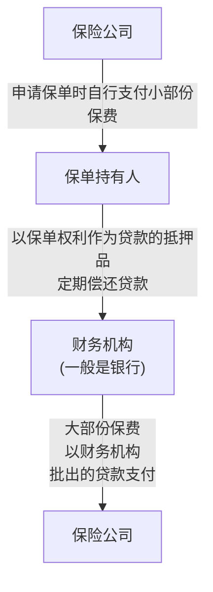
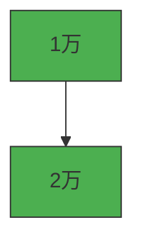
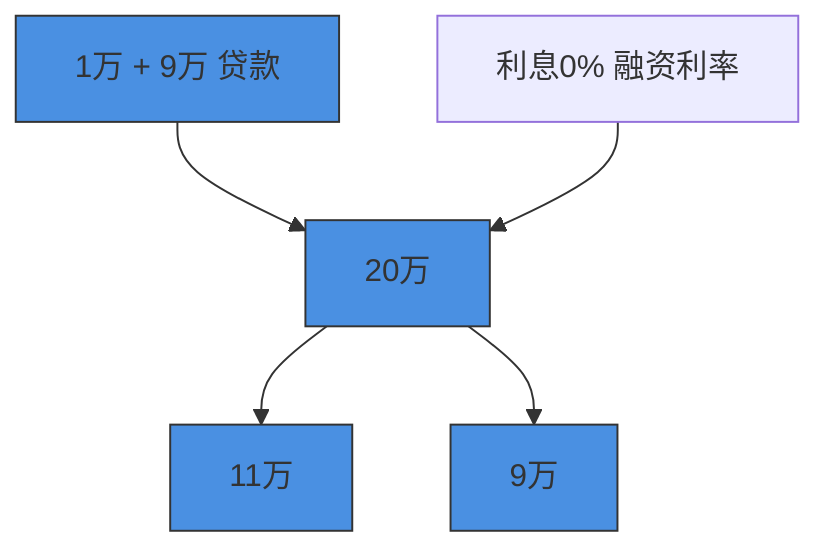
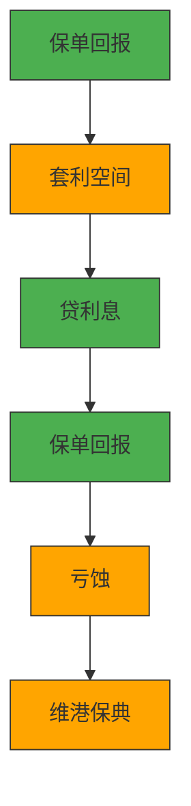

# 年化单利14%，香港融资保单是骗局吗？

**最近，在香港出现了一种新的套利方式，很多高净值客户都非常喜欢。**

投入一笔钱，投资期限大概9-10年。

到期连本带利取出，年化单利10%以上，甚至能做到14%。

**这么高的收益，到底是怎么实现的****？****是不是画大饼，有没有猫腻**？

今天我们一次性讲清楚。

这种玩法的官方名字叫做**融资保单，它是一种纯粹的套利行为**。

具体怎么套利呢？

简单来说，就是你可以用类似贷款买房的方式，去买一份保单。

<!-- OCR内容：

flowchart

-->

比如，买一份500万的保单，只用出100万的首付，剩下400万找银行贷款。

但是这个保单的收益，还是按照本金500万给你算。

就相当于用1倍的本金投入，撬动了5倍的收益。

<!-- OCR内容：
产品（保单）  

flowchart

融资储蓄收益  
银行（融资）  

flowchart

-->

而你要付出的成本是什么呢，这400万贷款的利息，要给到银行。

但是，只要保单的收益比贷款的利息高，这笔套利就能做，而且贷款利息越低，越划算。

**具体套利收益有多少呢，我给大家用一个实际的产品测算一下。**

假如一位40岁的男性，想买一份200万美金的保单。

投入到中国人寿的一款产品里。

扣除各种保费优惠，实际总保费只需要180.9万。

而此时你可以从银行贷款148万，贷款手续费大概2.9万左右。

也就是最终，你自己只用出36万首付左右，就能成功拿下这张200万的保单。

到了保单第10年，这张保单的价值预期会涨到283万。

此时退保，还掉148万的银行贷款，以及这9年总共49.5万的利息，还能剩85.5万。

**也就是说，36万的本金，用了9年的时间变成85.5万，净赚49.6万。**

**年化单利13.79%。**

这么完美的收益模型，有没有什么风险呢？

主要有两点。

<!-- OCR内容：
## 理想情境

## 加息情境

flowchart

-->

**第一是成本端****。****贷款利率，是波动的，不确定的。**

这直接决定了你贷款的成本有多少。

**首先，融资保单的贷款利率跟香港市场的基准利率挂钩。**

香港的利率主要有两个，一个叫P率，最优贷款利率，类似于内地的lpr。

还有一个叫H率，香港银行间同业拆借利率。

P率比较稳定，长期波动小，而H率波动很大，经常变来变去。

<!-- OCR内容：
## 一个月HIBOR & 最优惠利率 走势图

line chart

| Date       | 1M Hilbor | Prime Rate |
|------------|-----------|----------|
| 2015-08-28 | 0.1       | 5.3      |
| 2015-10-28 | 0.1       | 5.3      |
| 2016-02-28 | 0.1       | 5.3      |
| 2016-04-28 | 0.1       | 5.3      |
| 2016-06-28 | 0.1       | 5.3      |
| 2016-08-28 | 0.1       | 5.3      |
| 2016-10-28 | 0.1       | 5.3      |
| 2017-02-28 | 0.1       | 5.3      |
| 2017-04-28 | 0.1       | 5.3      |
| 2017-06-28 | 0.1       | 5.3      |
| 2017-08-28 | 0.1       | 5.3      |
| 2017-10-28 | 0.1       | 5.3      |
| 2018-02-28 | 0.1       | 5.3      |
| 2018-04-28 | 0.1       | 5.3      |
| 2018-06-28 | 0.1       | 5.3      |
| 2018-08-28 | 0.1       | 5.3      |
| 2018-10-28 | 0.1       | 5.3      |
| 2019-02-28 | 0.1       | 5.3      |
| 2019-04-28 | 0.1       | 5.3      |
| 2019-06-28 | 0.1       | 5.3      |
| 2019-08-28 | 0.1       | 5.3      |
| 2019-10-28 | 0.1       | 5.3      |
| 2020-02-28 | 0.1       | 5.3      |
| 2020-04-28 | 0.1       | 5.3      |
| 2020-06-28 | 0.1       | 5.3      |
| 2020-08-28 | 0.1       | 5.3      |
| 2020-10-28 | 0.1       | 5.3      |
| 2021-02-28 | 0.1       | 5.3      |
| 2021-04-28 | 0.1       | 5.3      |
| 2021-06-28 | 0.1       | 5.3      |
| 2021-08-28 | 0.1       | 5.3      |
| 2021-10-28 | 0.1       | 5.3      |
| 2022-02-28 | 0.1       | 5.3      |
| 2022-04-28 | 0.1       | 5.3      |
| 2022-06-28 | 0.1       | 5.3      |
| 2022-08-28 | 0.1       | 5.3      |
| 2022-10-28 | 0.1       | 5.3      |
| 2023-02-28 | 0.1       | 5.3      |
| 2023-04-28 | 0.1       | 5.3      |
| 2023-06-28 | 0.1       | 5.3      |
| 2023-08-28 | 0.1       | 5.3      |
| 2023-10-28 | 0.1       | 5.3      |
| 2024-02-28 | 0.1       | 5.3      |
| 2024-04-28 | 0.1       | 5.3      |
| 2024-06-28 | 0.1       | 5.3      |
| 2024-08-28 | 0.1       | 5.3      |
| 2024-10-28 | 0.1       | 5.3      |
| 2025-02-28 | 0.1       | 5.3      |
| 2025-04-28 | 0.1       | 5.3      |
| 2025-06-28 | 0.1       | 5.3      |
| 2025-08-28 | 0.1       | 5.3      |

-->

目前香港各大银行的P率在5.25%左右，目前1个月期的H率是2%出头。

但是，不要误会了，你做融资保单，实际的贷款利率并不等于这两个利率。

一般银行，会在P上减点。

比如，实际给到你P-2，P-1.9的贷款利率。

而在H上给你加点，比如H+1.25。

**其次，不同的银行，贷款政策完全不一样。**

比如说，国寿的这个产品，如果在香港的广发银行贷款，它的利率就很简单，直接等于p-1.9。

按照目前的p值5.25%算，贷款利率就是5.25-1.9%=3.35%。

最关键的是，它还给你设定了一个安全区间。

实际贷款利率封顶3.9%，最低3.1%。

也就是，不管以后市场利率涨到多高，贷款的实际利率不会高于3.9%。

但同时坏处是，当市场利率非常低的时候，你的贷款利率不会跟着降到非常低。

但总体来说，这种方式，能把你的成本锁定在一个可控的范围，大大降低了贷款成本波动的风险。

**但还有一种方式，比如说交通银行，它的利率计算方式就更复杂。**

同时跟P和H两个值有关。

它会算两个利率，一个是P-2，一个是H+1.25。

这两个值，谁小就用谁。

这张图是过去10年两个值得变动趋势，能看出来，有时候是蓝线低，有时候是黑线低。

<!-- OCR内容：
## 融资利率走势图

line chart

| Date       | IM HIBOR+1.25 | P-2% |
|------------|---------------|------|
| 2016-08-28 | 1.5           | 3.0  |
| 2016-10-28 | 1.6           | 3.0  |
| 2017-02-28 | 1.7           | 3.0  |
| 2017-04-28 | 1.8           | 3.0  |
| 2017-06-28 | 1.9           | 3.0  |
| 2017-08-28 | 2.0           | 3.0  |
| 2018-02-28 | 2.1           | 3.0  |
| 2018-04-28 | 2.2           | 3.0  |
| 2018-06-28 | 2.3           | 3.0  |
| 2018-08-28 | 2.4           | 3.0  |
| 2019-02-28 | 2.5           | 3.0  |
| 2019-04-28 | 2.6           | 3.0  |
| 2019-06-28 | 2.7           | 3.0  |
| 2019-08-28 | 2.8           | 3.0  |
| 2019-10-28 | 2.9           | 3.0  |
| 2020-02-28 | 3.0           | 3.0  |
| 2020-04-28 | 3.1           | 3.0  |
| 2020-06-28 | 3.2           | 3.0  |
| 2020-08-28 | 3.3           | 3.0  |
| 2020-10-28 | 3.4           | 3.0  |
| 2021-02-28 | 3.5           | 3.0  |
| 2021-04-28 | 3.6           | 3.0  |
| 2021-06-28 | 3.7           | 3.0  |
| 2021-08-28 | 3.8           | 3.0  |
| 2021-10-28 | 3.9           | 3.0  |
| 2021-12-28 | 4.0           | 3.0  |
| 2022-02-28 | 4.1           | 3.0  |
| 2022-04-28 | 4.2           | 3.0  |
| 2022-06-28 | 4.3           | 3.0  |
| 2022-08-28 | 4.4           | 3.0  |
| 2022-10-28 | 4.5           | 3.0  |
| 2023-02-28 | 4.6           | 3.5  |
| 2023-04-28 | 4.7           | 3.5  |
| 2023-06-28 | 4.8           | 3.5  |
| 2023-08-28 | 4.9           | 3.5  |
| 2023-10-28 | 5.0           | 3.5  |
| 2024-02-28 | 5.1           | 3.5  |
| 2024-04-28 | 5.2           | 3.5  |
| 2024-06-28 | 5.3           | 3.5  |
| 2024-08-28 | 5.4           | 3.5  |
| 2024-10-28 | 5.5           | 3.5  |
| 2025-02-28 | 5.6           | 3.5  |
| 2025-04-28 | 5.7           | 3.5  |
| 2025-06-28 | 5.8           | 3.5  |
| 2025-08-28 | 5.9           | 3.5  |

-->

总体来说。

过去10年，按照这种方式来贷款，实际利率在1.5%到4.25%之间。

比上面那个方式，波动更大，但是也能享受到市场利率非常低的时候。

**所以说，如果你想做融资保单。**

贷款千万不能随便贷，因为不同银行，不同利率政策可能决定了你的贷款成本差出几万几十万。

直接影响到套利的利润。

而且不同银行贷款手续费也不一样，也是成本。

一定要有一个专业的人给你把关，比较清楚每家银行的政策，帮你选一个最有性价比的方式。

如果有需要可以直接留言【政策】了解详情。

**第二是收益端，保单收益能否达成预期**

做融资保单的产品，基本都是分红型保险。

也就意味着，保单的预期收益是根据分红来的，有一定的不确定性。

但是，分红不确定，不代表没有。

**首先，既然能做融资保单的产品，都是银行严选****过的产品。**

往往首年保证现金价值，就非常高。

如果不达标，对不起，银行是不接受的。

其次，在银行筛选过一道之后，我们可以自己再筛一次。

**根据过往的分红实现率来看这家公司分红靠不靠谱。**

比如说。

我上面举例的这个产品，来自国寿，它过往的终期红利实现率全部100%达成。

<!-- OCR内容：
維港保典

HONG KONG INSURANCE

分红实现率

平均值

最高

分红实现率

高于70%分红

实现率数据占比

终期红利

100%

100%

100%

周年红利

82%

109%

97%
-->

这种公司的产品，买了就可以很放心。

如果你实在不放心，我们之前有一期视频做过一个极限的压力测试。

就算分红实现率只能实现60%甚至更低，这个产品依然是赚的。

而且这个假设已经非常极端了，因为国寿在香港40多年，

所有产品，各种类型的分红实现率都没有低于过60%这个值。

如果你有需要，可以直接私信【压力测试】，我会安排专业的顾问帮你详细测算每一种情况下的收益。

**总得来说，香港融资保单，是一种在特定降息周期下非常好的一种套利方式。**

虽然它有一定的风险，但是可以通过我上面说的两种方式，从成本端和收益端做好筛选。

把风险控制在较低的水平，博取一个不错的收益。

但是，我也要跟大家泼盆冷水，融资保单，它是一个有钱人的游戏。

不是谁想做就能做的，

很多银行，会要求你一定的资金体量，要验资证明，或者需要你在他们银行存一定的钱。

如果你对这种限时的套利方式感兴趣，可以直接留言【融资保单】，

我会安排专业的顾问老师，帮你对比各家银行政策，筛选最稳健的产品，做好压力测试。

看看这件事到底值不值得做。
