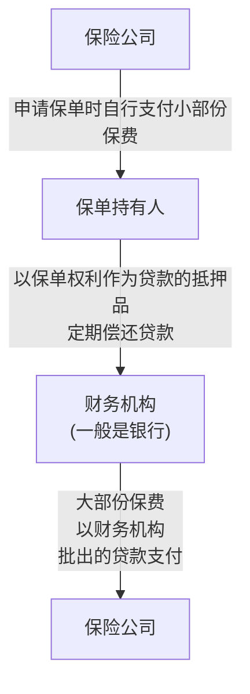

# 香港融资保单深度盘点：年化单利超20%，高净值人群套利新选择

链接：https://mp.weixin.qq.com/s/hyeAphJ30pf6WCRaWBe81w

StartFragment

# 香港融资保单深度盘点：年化单利超20%，高净值人群套利新选择

原创Cindy港险私人定制师_2026年5月8日 15:06__重庆_
在香港高净值人群的资产配置清单中，融资保单近期异军突起，成为备受追捧的套利工具——**仅需投入13万美金，持有8年即可净赚25万美金，年化单利突破20%**，这样的收益表现，让不少投资者纷纷入局。

但高收益背后，既藏着杠杆套利的逻辑，也伴随着潜在风险。**不同于普通储蓄险，融资保单的核心是“以贷投保”，用少量自有资金撬动大额保单收益，其收益空间与风险控制，均与产品选择、银行贷款政策密切相关。**本文将全面盘点当前香港市场热门融资保单产品，拆解套利逻辑、风险要点，帮你清晰看懂这一高收益配置工具。

**一、先懂风险，再谈收益**

**融资保单核心风险提前知晓**

在深入了解产品前，需明确：**融资保单虽能放大收益，但并非无风险套利，核心风险集中在两点，提前认知才能理性决策，避免踩坑。**

**分红实现率风险：**融资保单的收益依赖保单预期分红，若保险公司分红实现率不达标，实际收益会大幅缩水。因此，**选择分红实现率稳定的险企，是降低该风险的关键**——本文盘点的3款产品，其所属险企均具备稳健的分红表现：**国寿历史所有终期分红实现率100%，万通平均分红实现率99%，中银平均分红实现率80%-90%**，未来收益兑现概率可达八九成。**贷款利率波动风险：**融资保单的核心是**“赚保单收益与贷款利息的利差”**，若市场利率上行，贷款成本会随之增加，压缩收益空间；**若处于降息周期，则会进一步放大收益。**值得注意的是，**部分银行会设置贷款利率上限，即便市场利率上涨，贷款成本也不会超出限定范围，能有效降低利率波动带来的风险。**

**二、科普拆解**

**什么是融资保单？套利逻辑很简单**

很多人对融资保单的认知较为模糊，其实它的核心逻辑与贷款买房高度相似，本质是**“用杠杆放大收益”**，操作门槛虽高于普通保单，但逻辑通俗易懂。

简单来说，融资保单就是**“以少量自有资金为首付，向银行贷款支付剩余保费，购买大额保单”**——比如一份总保费500万的保单，你只需支付100万自有资金（首付），剩余400万向银行贷款；**只要保单的长期收益高于银行贷款利率，就能实现套利，且贷款利率越低、杠杆比例越高，套利空间越大。**

<!-- OCR内容：

flowchart

-->

**核心优势在于“收益放大”：**你仅用100万自有资金，就能撬动500万保单的收益，相当于收益直接放大5倍，这也是融资保单能实现年化单利超20%的核心原因。

**三、香港热门融资保单大盘点**

**（3款优选，数据精准无偏差）**

本次盘点的3款产品，均来自分红实现率稳健的险企，涵盖不同**贷款政策、收益梯度**，适配不同资金规模的投资者，所有数据均**严格对应原版，无新增、无偏差。**

**（一）万通富饶盈家：年化单利23%，收益最亮眼**

作为当前市场收益表现最突出的融资保单，万通富饶盈家凭借低贷款成本、高收益空间，成为高净值人群的首选，具体细节如下：

**保费规则：**总保费100万美金，选择一次性预缴，扣除所有保费优惠后，实际需缴总保费91.9万美金；

**贷款配置：**自有资金仅需支付13.3万美金，剩余78.6万美金可向蚂蚁银行申请贷款；

**贷款利率：**与香港一个月期HIBOR（同业拆借利率）挂钩，具体为H＋0.8%，且设置利率上限，最高不超过P-1%（P为最优贷款利率）；按当前市场节点计算，实际贷款利率为3.275%；

**贷款成本：**需支付0.5%的贷款手续费；

**收益测算：**持有8年，扣除贷款本金、8年利息及手续费后，净赚25.5万美金；以13.3万美金自有资金计算，年化复利10.31%，年化单利高达23%，收益表现堪称惊艳。

**（二）中国人寿丰饶传承3：多银行可贷，灵活度高**

国寿丰饶传承3的核心优势的是**贷款渠道灵活**，不同银行贷款政策不同，适配不同需求的投资者，具体细节如下：

**保费规则：**总保费100万美金，扣除所有保费优惠后，实际需缴总保费90.4万美金；

**贷款配置：**以香港广发银行为例，可向银行贷款74万美金，需支付2%的贷款手续费；自有资金实际仅需支付约18万美金；

**贷款利率：**采用P-1.9的政策，设置利率上下限，最高不超过3.9%，最低不低于3.1%；按广发当前P值计算，实际贷款利率为3.35%；

**收益测算：**持有9年，扣除贷款本金、9年利息及手续费后，净赚21万美金；以18万美金自有资金计算，年化复利6.64%，年化单利12.98%，收益稳健且灵活。

**（三）中银人寿薪火传承：母公司背书，贷款利率极低**

中银人寿薪火传承依托中银香港的母公司优势，享有**专属低息贷款政策**，风险可控性强，具体细节如下：

**保费规则：**总保费达到100万美金及以上，可享受8.5%首期保费折扣+1.5%额外折扣，打完折后实际需缴保费90万美金；

**贷款配置：**可向母公司中银香港申请贷款，贷款比例最高70%，即63万美金；自有资金仅需支付27万美金；

**贷款利率：**采用P-2.3%的专属政策（P为最优贷款利率），随市场波动但相对稳定；当前中银香港P值为5%，实际贷款利率仅2.7%；贷款额度越高，减点越多，最高可至P-2.5%，且无任何贷款手续费；

**收益测算：**持有5年，100万美金保单预期增值至112.6万美金；扣除贷款本金63万美金、5年利息8.5万美金后，剩余41.1万美金；以27万美金自有资金计算，年化复利8%，年化单利10.48%，收益稳健、成本极低。

**四、核心总结**

**融资保单适合谁？怎么选？**

**适配人群：**融资保单对资金量有一定要求，**更适合有闲置资金、追求高收益且能承受一定利率波动风险的高净值人群**，不适合资金流动性紧张、风险承受能力弱的普通投资者。**产品选择逻辑：**优先选择**“分红实现率稳+贷款利率低+杠杆比例高”**的产品——追求极致收益可选万通富饶盈家，追求稳健灵活可选中银人寿薪火传承，偏好多贷款渠道可选国寿丰饶传承3。**风险底线：**无论选择哪款产品，**均需优先关注险企分红实现率，同时确认贷款利率是否有上限**，降低利率波动风险；建议提前获取收益压力测试报告，清晰了解不同场景下的真实收益，避免盲目入局。

融资保单的高收益，本质是杠杆与稳健收益的结合——**它不是“躺赚”的捷径，而是需要理性判断、科学选择的资产配置工具。**选对产品、控好风险，才能真正享受杠杆套利带来的收益红利。

• END •

****C姐—****香港保险经纪人****

我们提供1V1免费定制服务，助力大家精准匹配最优方案！**欢迎扫描文末二维码，我们详细交流～**

**作者简介:**CC，香港保险经纪人，作为香港保险业九年资深从业者，已连续多年达成行业顶级荣誉——百万圆桌会员MDRT、顶尖会员TOT，累计为500+中高净值客户家庭提供境外资产配置，擅长为精英人士提供全方位的财富保障方案。

免责声明：本微信公众号所载任何文章、音视频、数据及资料并不构成亦不应被诠释为向香港境外之任何人士招揽、要约、出售、提供、建议或游说购买任何保险产品。上述任何资料仅供参考，有关内容只属一般资讯，适用于身处香港人士。不应被视为并且不构成专业意见或任何产品或服务的要约、招揽或建议，亦不可视为任何产品或服务的销售邀请。本微信公众号所载的产品及服务不代表都适合或适用于所有个别人士或任何类别的人士, 就上述任何资料提及的主题作出任何决定前，建议向专业人士寻求独立意见。本微信公众号不就所载文章、音视频、数据及资料的准确性、完整性、可靠性或适合任何特定用途，作出任何明示或暗示的说明、保证或陈述，也恕不负责该等文章、音视频、数据及资料之任何错误、遗漏或过时(如有)。本微信公众号无意于中国内地向任何人士作分发或复制，明确表明概不因他人使用或诠释以上之任何资料而承担任何责任。
阅读521

# 

​

港险私人定制师3个朋友关注关注赞2推荐写留言复制搜一搜复制搜一搜暂无评论EndFragment

---