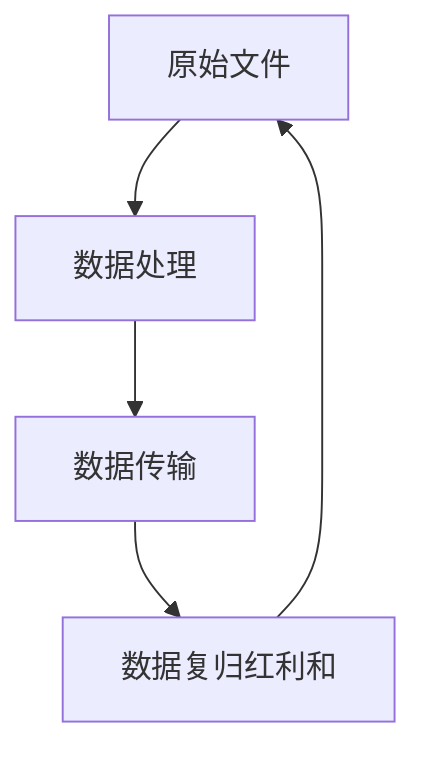

# 全方位升级！友B「财F盈活」全新登场，收益更强、用钱更活、传承更稳！

链接：https://mp.weixin.qq.com/s/fUmtmD1FjNpWCgl7ie9hQA

StartFragment

# 全方位升级！友B「财F盈活」全新登场，收益更强、用钱更活、传承更稳！

Cassie全方位PLUS_2026年6月3日 16:58__广东_

香港储蓄险又又又上新啦

这次是友B保险，推出新一代王牌储蓄险—「财F盈活储蓄计划」

「财F盈活」作为「环Y盈活」的升级版，在收益、灵活、传承3大维度上全方位升级，将“好赚、好取、好传” 做到了更强！

中短期收益优势很突出，20年预期IRR高达5.83%，快至27年登顶6.5%，稳居当前港险市场上第一梯队！

今天，小编为大家整理了**「财F盈活」**的各项产品特点，看看它究竟“盈”在哪~

**01**

**产品亮点**

<!-- OCR内容：
## 财F盈活

高收益·活取用·稳传承

## 计划亮点

## 收益领跑，快达封顶

- 【5年缴】快至7年回本，20年预期IRR达 $5.83\%$ ，27年登顶 $6.5\%$ 市场领先  
- 【整付】快至5年回本，10年预期IRR达5.19%，28年登顶6.5%市场领先

## 灵活资金，取用随心

566/567/578等多元提领密码，先回本再提领更安心  
- 「灵活提取选项」可定期提取保单价值给指定收款人  
市场罕有「价值保障选项」可提取保单价值，转移至价值保障户口，以赚取非保证利息

## 全球布局，自主掌控

市场首创「货币转换选项」+「红利及分红锁定&解锁选项」，资产配置更灵活

## 周全守护，传承无忧

市场首创「未来心愿安排」可预先订立指示，于发生关键人生时刻时生效，传承规划决定可按意愿执行  
市场首创「受益人灵活选项」和「健康障碍选项」，无惧健康突变  
- 延续「保单分拆选项」、「更改受保人/第二受保人选项」、「身故赔偿支付办法」等经典传承选项，财富稳稳传递

性别：男

年龄：0岁

缴付期：5年

年交保费：10万美金

总保费：50万美金

案例演示

<table><tr><td>年龄</td><td>预期现金价值(美金)</td><td>预期IRR</td></tr><tr><td>10岁</td><td>66万</td><td>3.55%</td></tr><tr><td>15岁</td><td>93万</td><td>4.90%</td></tr><tr><td>20岁</td><td>139万</td><td>5.83%</td></tr><tr><td>30岁</td><td>293万</td><td>6.50%</td></tr><tr><td>50岁</td><td>1032万</td><td>6.50%</td></tr><tr><td>70岁</td><td>3635万</td><td>6.50%</td></tr><tr><td>100岁</td><td>2亿4041万</td><td>6.50%</td></tr></table>
-->

（图片制作：全方位PLUS，转载请注明来源）

**1、收益领跑，快达封顶**

买储蓄险，大家最关心的就是 “多久回本、钱能不能涨、长期收益稳不稳”，「财F盈活**」**直接把优势拉满👇

**以5年缴费期为例**

＋

**回本快：**预期回本期快至7年

＋

**中短期回报高：**10年预期IRR达3.55%，20年预期IRR达5.83%

＋

**登顶早：**27年预期IRR登顶6.5%

（图片制作：全方位PLUS，转载请注明来源）

「财F盈活**」的**中短期回报稳居当前港险市场上第一梯队！

简单说：**前期回本快，中短期回报高，登顶6.5%更早、长期收益还稳**，不管是短期闲置资金打理，还是想长期稳稳增值，「财F盈活**」**都完美适配！

**「财F盈活」VS「**环Y盈活**」👇**

可以看到，「财F盈活」**中短期回报更高，登顶6.5%更早！**

**而且，过往同类型产品「充Y未来」、**「盈Y」系列的分红实现率都很不错，已公布的最新分红实现率可查询👉多款主力产品连续多年100%达成！友邦公布2024年分红实现率！****

**2、灵活资金，取用随心**

「财F盈活」加强了**预期复归红利的现金价值**，比「环Y盈活」高出不少，这样也提高了保单价值在提取后的潜在回报！

简单来讲，在相同的现金提取情况下，「财F盈活」在现金提取后的退保发还金额比「环Y盈活」高，而且比「环Y盈活」可持续更长的提取期，在提领上的优势更明显！

以同样5年缴费期，总保费50万美元，从第7年起每年提取4万美元为例👇

「环Y盈活」在保单第48年就提取完了全部退保价值了，保单将会终止；而「财F盈活」能**可持续的提取到保单第100年，而且提取后的账户还剩余超768万美元！**

**「财F盈活」可实现快速提领，****想取多少、什么时候取，都能自己定，临时急用钱也能灵活提取，资金灵活不锁死。****
**

**(1)支持566/567/578****等多元提领密码，先回本再提领更安心
**

**热门“567”**提领密码—**5**年缴费，保单提取早至保单第**6**年末，每年提取总保费的**7%**，直至保单结束，自制终身稳定的现金流。

**10万美金X5年提取示例👇**

（图片制作：全方位PLUS，转载请注明来源）

**年年稳定提领，平时临时周转、日常花销都够用了，活多久领多久，一份保单就可覆盖人生不同阶段用钱需求~**

**(2)******「灵活提取选项」**
**

**第5个保单周年日起，可设定指示，定期提取保单价值给指定收款人，实现专款专用。**

**(3)市场罕有-******「价值保障选项」****

**第6个保单年度终结后起，可提取保单价值，转移至价值保障户口，以**赚取非保证利息。

**多元领取搭配灵活支取与增值账户，**「财F盈活」**既能按需用钱、终身提领，又能盘活资产博取额外收益，灵活用钱+稳健增值两者兼得。**

**3、全球布局，自主掌控**

**(1)市场首创-******「货币转换选项」****

**「财F盈活」**同样支持**9****种****货币自由转换**。

**第2个保单周年日起，****支持港元、美元、人民币、英镑、欧元等9种主流货币随心切换，****每个保单年度可行使1次，可******根据汇率、家庭规划随时调整保单币种，****灵活调整资产配置。****

****(2)「红利及分红锁定&解锁选项」****

第15个保单年度完结后起，每个保单年度完结后30日内申请行使**「红利和分红锁定选项」**1次。

**行使**「红利和分红锁定选项」**后至少1年，**持有人可解锁红利及分红锁定户口部分或全部价值。

<!-- OCR内容：
每个保单年度一次  

flowchart

每个保单年度一次

于红利及

分红锁定户口

作为保证金额
-->

****依托9种币种灵活转换、分红可锁可解两大优势，「财F盈活」可轻松布局全球资产，主动权完全掌握在自己手里！****

****4、周全守护，传承无忧****

****(1)**市场首创-****「未来心愿安排」**

可预先订立指示，于发生关键人生时刻时生效，传承规划决定可按意愿执行。

即3个触发事件预先规划未来，3种处理方式实现按自己意愿处理，3个后备角色确保传承顺利执行，仅需1份表格即可完成。

**· 3个触发事件**

**· 提供3种处理方式**

**· 设置3个后备角色**

******(2)****「保单暂管人安排」及市场首创-「未来守护选项」，传承更具弹性**

**·「****保单暂管人安排****」**

可指定1位家庭成员为保单的第二持有人，及另1位年满18岁或以上的家庭成员为保单暂管人。

若保单持有人不幸身故，保单暂管人将在有限的行政操作权利下看管保单，直至指定第二持有人达到保单持有人所指定的日期/年龄接管保单拥有权。

**·市场首创-「未来守护选项****」**

保单暂管人可拆分保单为两份，从「保单暂管人安排」下现有第二持有人的家庭成员中，指定1位为分拆保单的新第二持有人及新受保人，待其达暂管人指定日期/年龄即可接管保单。

********(3)市场首创**-********「受益人灵活选项」和「健康障碍选项」，无惧健康突变**

**·市场首创-「受益人灵活选项****」**

当受益人已达保单持有人所选的指定年龄或****年满18岁或以上时被诊断****患上指定疾病，该受益人可按其已选的支付办法，收取属于自己部分尚未支付的身故赔偿和意外身故赔偿余额。

<!-- OCR内容：
在受益人 (i) 达指定年龄或 (ii) 于年满18岁或以上时被诊断患上「受益人灵活选项下之指定疾病」之前※

将按保单持有人

在「身故赔偿支付办法」下作出的要求，向受益人支付赔偿在受益人(i)达指定年龄或(ii)于年满18岁或以上时被诊断患上「受益人灵活选项下之指定疾病」之后※

受益人可按他/她

于「受益人灵活选项」下选择的支付办法收取款项

## 定额分期支付

或

定额递增百分比分期支付

或

一笔过支付部分金额，余额以分期支付

或

首次领取日期选项

首次赔偿，

及定额分期支付

首次赔偿，

及定额递增百分比分期支付

## 一笔过支付

\_\_\_\_ 或 \_\_\_\_

定额分期支付

—— 或 ——

定额递增百分比分期支付

——或——

一笔过支付部分金额，余额以分期支付
-->

****自主权由持有人传承到受益人，实现真正财富传承！****

******·市场首创-「健康障碍选项****」******

若不幸出现精神问题或因指定疾病(包括植物人及昏迷)而导致一段期间失去意识时，确保您的挚爱在财务上获得支援。

可预设最多2位18岁或以上的家庭成员为指定接收人，指定保单价值百分比以支付款项、转移拥有权，若持有人不幸出现精神问题或指定疾病，指定接收人即可申请。

********(4)******延续「保单分拆选项」、「更改受保人/第二受保人选项」、「身故赔偿支付办法」等经典传承选项，财富稳稳传递**

**·**第1个保单年度完结起可**「分拆保单」**

**·****「更改受保人选项」及「第二受****保人选项」**

**「更改受保人选项」**：第1个保单年度完结后起且现有受保人在生时，可无限次更改受保人。

**「第二受保人选项」**：**持有人可在现有受保人在生时，指定1位挚爱家人为第二受保人。当现有受保人身故，第二受保人将会成为新的受保人，无需终止保单且保单价值将不受影响，更好保障财富。**

· 6种**「****身故赔偿支付方式****」**可自选

若受保人不幸身故及没有第二受保人成为新的受保人，将向保单选定的受益人支付身故赔偿，确保挚爱按计划得到保障。

赚钱难，守财、传财更难，而**「财F盈活」的**全方位传承设计， “财富怎么传、传给谁、什么时候传” 全由自己说了算，传承贴心到极致，可将财富稳稳传给下一代~

**02**

**其它亮点**

**1、****「卓越成绩奖」**

若受保人于保单生效满1年后及于25岁前达到以下其中一项学业成绩，将于保单生效期间支付相应奖金金额。

就同一受保人的所有**「财F盈活」**保单只可获支付该奖项1次。

**2、****「延缴保费权益」***仅适用于5年缴保单

在基本保单的保费缴付期期间，若发生指定事件，即可申请该权益。若批准申请后，迟缴保费的宽限期将会由31日延长至最多365日。

期间保单仍然生效和会继续为受保人提供保障，也会提供额外的财务弹性，该权益只可申请1次。

**3、****「末期疾病利益」**

若受保人不幸确诊末期疾病，并预计会因该疾病在12个月内身故，会一次过预先支付身故赔偿金额作为「末期疾病利益」。

**03**

**案例演示**

**04**

****「财F盈活」VS****「环Y盈活」投保门槛********

**1、****「财F盈活」**

**

**

**注意：6月份可享限时优惠，较低门槛投保****「财F盈活」👇******

******【5年期】************年缴5万美金起******

******【整付】25万美金起******

**2、****「环Y盈活」**

对比来看，******「财F盈活」******投保门槛更高，但中短期收益也更好，更适合高净值人群配置。

**05**

**关于友B**

友B保险于1919年在上海成立，1931年进入香港市场，历经百年发展，现已成为香港保险市场的领军企业，拥有着千亿美元级别的雄厚投资实力。

作为全球最大的泛亚地区独立上市人寿保险集团，业务覆盖18个市场。同时，也是**香港地区持有保单数量最多的保险公司**，且在香港及澳门两地，连续多年**MDRT（百万圆桌会议）会员人数排名第一**。

提供**超120种**涵盖保障与理财需求的多元化产品，广泛服务于香港及澳门的**超360万**名客户，历经多轮经济周期考验，长期分红实现率表现稳健，市场口碑与认可度高。

香港全方位-保险，赞3

总的来说，「财F盈活」算得上今年综合表现很亮眼的储蓄新品，收益、灵活、全球配置、传承四大优势样样能打，收益高、取用活且传承稳，真的夯爆了！

****香港友B保险相关文章：****

****低成本撬动30倍人寿杠杆！友B「活R人生」，保障、增值、传承，一张保单全搞定！****

****友B保险2025年成绩单出炉！新业务价值达55.16亿美元，创历史新高！****

****30年预期IRR6.5%！友B重磅推出全新力作--「环Y盈活」储蓄计划，中短期回报更“出圈”！****

****多款主力产品连续多年100%达成！友邦公布2024年分红实现率！****

**END**

申明:本文并不构成亦不应被诠释为向香港境外之任何人士招揽、要约、出售、提供、建议或游说购买任何保险产品。本文所载资料仅供参考，有关内容只属一般资讯，不可视为任何产品或服务的销售邀请。如对本文的内容有任何疑问，应向独立人士寻求专业意见。任何情况下，慨不就本文内容的任何建议、意见或陈述而引至的直接或间接、特殊、附带、相应而生的任何损害、损失或法律责任承担任何责任。任何因未经本公众号授权而转载而带来的问题或纠纷均由转载方负责。*版权免责声明：部分图文分享自互联网，如侵权请微信告知处理；

▼

**星标关注**

了解更多香港资讯

**全方位PLUS**专注香港，一网打尽 保险金融|教育升学|房产置业|全球移民|增值服务等各类专业资讯！361篇原创内容公众号
香港保险 · 目录上一篇香港保险丨2026年6月最新优惠汇总！多家保司延长预缴优惠，最高达4.5%利率！阅读82

# 

​

全方位PLUS23个朋友关注关注1161写留言复制搜一搜复制搜一搜暂无评论EndFragment

---
