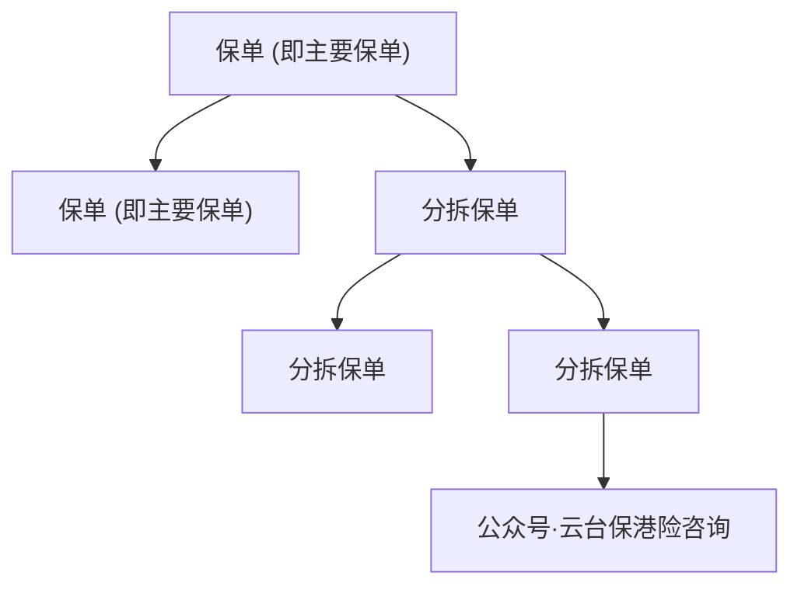

# 友邦新品--财富盈活正式上线！到底升级在哪？对标环宇盈活谁更强？适配哪些人？一文给大家理清

链接：https://mp.weixin.qq.com/s/YPMJUjgXuQN_tmZGWTjE6g

StartFragment

# 友邦新品--财富盈活正式上线！到底升级在哪？对标环宇盈活谁更强？适配哪些人？一文给大家理清

原创云台保云台保港险咨询_2026年6月3日 14:30__江苏_

筹备近一年，友邦重磅迭代储蓄王牌产品——财富盈活储蓄保险计划已于 2026 年 6 月 1 日正式开售。

作为环宇盈活的迭代升级版，这款新品立足财富增值、灵活支取、家族传承三大核心需求完成全方位优化升级。

打破前代产品多项配置局限，是当下跨境储蓄赛道综合实力突出的标杆产品，下文从三大核心优势拆解产品亮点。

# 一、财富增值：回本更快

收益是储蓄类保险的核心竞争力，也是本次财富盈活升级的重中之重，产品实现短期回本提速、中期收益领跑、长期复利稳固三大突破。

我们以 5 年缴费、总保费 50 万美元的投保方案，对标前代环宇盈活做数据对比。

1.回本周期亮眼：

两款产品保证回本周期均锁定 18 年，预期回本统一仅需 7 年，在同类长期储蓄产品里回本效率位居前列，大幅缩短资金回笼等待周期。

2.中期收益稳步拉开差距：

投保第 10 年，财富盈活预期年化回报率 3.55%，环宇盈活为 3.51%；

来到第 20 年，收益差距进一步扩大，前者年化 5.83%，后者 5.69%，产品前期增值能力实现稳步领先。

3.长期封顶收益更早兑现：

产品终极预期 IRR 可达 6.50%，财富盈活投保第 27 年即可触及该收益峰值，而老款环宇盈活需要等到第 30 年才能达标，足足提前 3 年兑现顶格收益；

持有至第 100 保单年度，财富盈活预期现金价值可达 2.4 亿美元，长线复利增值潜力充足。

从保证现金价值维度来看，两款产品前期保证收益数值保持一致，保证回报率增长平缓、长期稳步抬升，第 100 年保证年化回报率稳定在 0.32%，刚性兜底属性不变，依托非保证的复归红利与终期分红实现收益跃升，兼顾资金安全性与增值空间。

整体来看，新品做到前期增值发力更快、中期收益持续领跑、长期收益封顶更早，全周期收益表现优于前代。

# 二、资金灵活支取：红利底盘加厚

不少储蓄保单在频繁领取现金流后，容易损耗本金、导致保单提前终止，而财富盈活针对性增厚复归红利现金价值，从底层结构提升取现容错率。

产品支取逻辑优势：

日常取现优先动用复归红利对应的现金价值，不动用保单基础本金与保证现金价值；复归红利储备越充足，每年支取现金流对保单的损耗就越小，保单存续周期也就越长。

实战测算（5 年缴 50 万美元，第 7 年起每年固定支取 4 万美元）：

环宇盈活因为红利储备有限，持续支取至第 48 个保单年度便耗尽账户价值，保单直接终止；财富盈活依托升级后的高额复归红利，可稳稳支撑每年固定支取直至第 100 年保单期满，完成百年取现后，账户剩余现金价值仍超 768.74 万美元。

同等支取条件下，两款产品存续周期差距悬殊，印证财富盈活红利底盘更扎实，既能满足终身现金流领用需求，又能保全本金持续复利增值，适配养老补贴、子女阶段性教育支出等常态化用钱规划。

# 三、家族传承：首创多项定制化权益

区别于传统储蓄险仅能身故定向赔付资金的单一传承模式，财富盈活搭建系统化传承方案。

新增多款市场独创权益，适配多子女、再婚家庭、子女未成年等复杂家庭资产配置场景，核心特色权益分为三大板块：

## （一）市场首创：未来心愿安排

投保人事先自定义触发条件，包含身故、丧失健康行为能力等多种场景，针对不同触发事件单独设置财富分配规则，实现财富按照自身意愿定向传承。

## （二）保单持有人分层配置

1.多位后备持有人规划：

可预先设置多位顺位第二持有人与后备受保人，若原定继承人无法顺利承接保单，备选人员按预设顺序接手资产，规避因继承人变故导致保单无人接管的风险；

2.保单暂管人制度：

投保人身故后，指定暂管人在限定权限内代管保单，等到原定第二持有人达到约定年龄 / 指定日期，再完成保单所有权移交，专门用于未成年子女资产托管；

3.未来守护分拆选项：

暂管人可按需拆分原保单，拆分后的独立保单定向过户给不同家庭成员，实现一笔资产拆分多份、子女分户继承，化解家族财产分配纠纷。

## （三）独创健康障碍保障选项

投保人确诊约定重疾或永久丧失民事行为能力前，提前指定最多两名成年家属，约定资金领取比例，出险后家属可按需选择一次性领取定额资金、直接受让部分 / 全部保单所有权，或是两种方式组合领取，提前规避失能后资产无人打理的难题。

# 四、附加各类需求

除三大核心优势外，产品附带多项灵活附加权益，进一步拓宽产品使用场景：

1.九币种自由转换：

投保满第 2 年起，可在美元、人民币、港币、欧元、英镑、澳元、加元、新加坡元、澳门币9 种币种间切换，对冲全球汇率波动带来的资产缩水风险；

2.红利锁定解锁：

保单第 15 周年起，每年可申请锁定非保证分红，锁定满 1 年后可随时解锁，锁定部分分红转化为保证资产，灵活把控收益落袋节奏；

3.价值保障专户：

投保满 6 年，可提取部分保单价值转入专属计息账户，享受额外非保证利息收益；

4.保单提前分拆：

保单生效满 1 年就能拆分保单，方便资产拆分赠与、分家析产；

<!-- OCR内容：

natural_image

Illustration of a document with a shield icon and a dollar sign, no text or symbols present.

主要保单

flowchart

-->

5.受益人灵活赔付：

受益人年满约定年龄或确诊特定疾病时，可自主选择一次性全额领取、按期定额领取、递增比例分期领、部分取现剩余分期等多种拿钱方式。

# 总结

财富盈活储蓄险凭借收益提速升级、取现韧性拉满、传承体系革新三大核心亮点，补齐前代产品短板。

既适合想要做长期财富增值、储备终身养老现金流的个人投资者，也适配高净值人群搭建跨代家族资产传承架构，是友邦本年度重磅布局的全能型储蓄产品。

想锁定长期稳健的高收益？友邦「财富盈活」值得重点关注！但香港保险产品琳琅满目，哪款才真正适合你？

扫码领福利：免费获取新品全方位资料 + 一对一专属计划书。专业顾问帮你拆解全市场热门产品，避开隐藏条款，定制你的增值方案。别让犹豫错过良机！

阅读21

# 

​

云台保港险咨询1个朋友关注关注21推荐写留言复制搜一搜复制搜一搜暂无评论EndFragment

---
