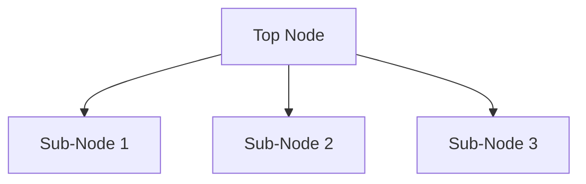
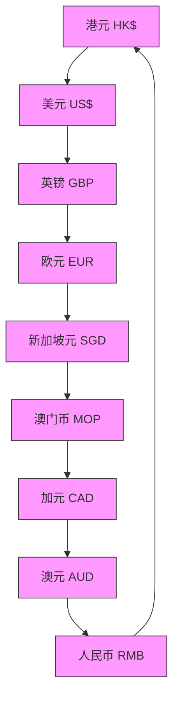

# 品鉴：爆款升级AIA「财F盈活」评测

链接：https://mp.weixin.qq.com/s/pTGznPCnYBkHuCRW3UdhDQ

StartFragment

# 品鉴：爆款升级AIA「财F盈活」评测

原创JC就是JC银河事务所_2026年5月31日 12:00__广东_

**欢迎各位老板点赞关注加星收藏！浩瀚银河，恭喜发财！O(∩_∩)O谢谢！**

## 一、产品背景：爆款接棒，定档上线

2026年5月，香港友邦签约中心异常火爆，大厅座无虚席、投保客户扎堆排队。带火这波热潮的，正是友邦王牌储蓄险——「环宇盈活」。

蛰伏打磨大半年后，其迭代升级版 「财富盈活储蓄保险计划」（以下简称"财富盈活"）正式官宣定档：2026年6月1日上线。

作为香港保险市场连续12年新造保单数目及有效保单数目双料第一的保险公司，友邦此次新品升级备受市场关注。

## 二、核心升级：三大维度全面进阶

财富盈活并非简单换皮，而是在**收益增速、现金流体验、传承功能**三大核心板块做了针对性升级。

****关键数据对比（5年缴、总保费50万美元方案）：****

指标

财富盈活（新款）

环宇盈活（老款）

保证回本期

18年

18年

预期回本期

7年

7年

第10年预期年化
**3.55%**
3.51%

第20年预期年化
**5.83%**
5.69%
**IRR达6.50%所需年限****27年**
⬇️

30年

百年期满预期总现金价值
**2.4亿美元**
2.4亿美元

核心变化：

前期收益小幅领先（第10年高0.04%）

中期差距拉大（第20年高0.14%）

高收益节点提前3年：27年即可达6.50% IRR，老款需30年

结论：财富盈活在保证回本不变的前提下，通过优化资产配置，实现了"前期发力更猛、中期涨得更快、峰值来得更早"的收益曲线。

### 2.2 现金流升级：加厚红利储备，取钱不伤本

这是财富盈活最实用的升级之一。

<!-- OCR内容：

natural_image

Illustration of a document with a dollar sign and pen, no text or symbols present

## 世代无缝

## 承传财富

- 预先制定传承安排，并可于首名第二持有人/首名第二受保人于原有保单持有人/原有受保人身故后未能成为新的保单持有人/新的受保人的情况下，额外指定最多两位第二持有人/第二受保人及他们的继承先后次序  
- 在未能预见的情况下，促使保单的延续

natural_image

Illustration of a rising trend with an upward arrow and dollar sign symbol (no text or labels)

## 长线保存家族财富， 维系家族和睦

- 透过结构性的传承规划及清晰指示，为您的传承提供清晰度与掌控力  
- 支持世代之间财富的稳健及有序传承

natural_image

Illustration of a hand holding a money bag with a dollar sign (no text or symbols)

## 以周全而灵活的安排， 支持挚爱

\- 可度身订造的受益人及支付安排，让您倍感安心
-->

**复归红利储蓄险的通病**：很多产品红利储备薄弱，一旦持续取钱就会侵蚀本金，最终保单提前失效。

**财富盈活的解决方案**：直接加厚复归红利储备。

**实测对比（5年缴50万，第7年起每年取4万）：**

产品

取钱持续时间

百年期满剩余价值

环宇盈活（老款）

第48年本金耗尽，保单终止

0

财富盈活（新款）
**稳取至100年满期****超768万美元**

**图表直观对比**（复归红利现金价值）：

从第20年起，财富盈活的复归红利现金价值就显著高于老款，且差距随时间持续扩大。到第90-100年，新款红利储备约为老款的**1.5-2倍**。

**结论**：财富盈活解决了"高收益但不敢取"的痛点，真正实现**"想取就取、取不伤本、终身可用"**。

### 2.3 传承功能升级：精细化财富分配体系

<!-- OCR内容：

natural_image

Illustration of a document with a stopwatch and green ribbon, no text or symbols present

## 保單暫管人安排

持有人可於保單指定一位家庭成員為保單的第二持有人，及另一位年滿18歲或以上的家庭成員為保單暫管人。在持有人不幸身故後，保單暫管人將在有限的行政操作權利下看管保單，直至當指定第二持有人在達到持有人所選的指定日期或指定年齡接管保單擁有權。

flowchart

## 未來守護選項

## 市場首創\*

保單暫管人可選擇將保單分拆為兩張保單，及指定現有第二持有人的另一位家庭成員為分拆保單的新第二持有人及新受保人，當其在達到保單暫管人所選的指定日期或指定年齡便可接管分拆保單的擁有權。公众号·银河事务所
-->

财富盈活在传承维度做了颠覆性升级，多个功能为**行业首创**：

#### ① 「未来心愿安排」服务（总保费≥50万美元解锁）

提前预设身故、丧失行为能力等突发场景的财富分配方案自己的钱自己说了算，杜绝后代财产纠纷

#### ② 「保单暂管人」功能（行业首创）

投保人不幸身故后，可提前指定专人代管保单资产搭配保单分拆功能，可灵活拆分资产给多个子女专治多子女、结构复杂家庭的传承难题

#### ③ 「健康障碍选项」（市场首创）

若因疾病、意外、精神问题丧失民事行为能力提前指定的两位家人可直接接管保单、领取现金、掌控资产对冲人生不确定风险，守住家庭底气

**传承功能总结**：从"只给钱"升级为"可规划、可代管、可应急"的完整传承体系。

## 三、附加功能一览

功能

详情
**9种货币自由切换**
投保第2年即可解锁：人民币、美元、港元、英镑、欧元、新加坡元、澳元、加元、澳门币
**红利锁定**
第15年起可自主锁定红利，1年后按需解锁
**保单分拆**
投保满1年即可分拆，适配分批传承
**定期定向提取**
支持自定义提取节奏
**受益人灵活调整**
按需变更

<!-- OCR内容：

flowchart

-->

## 四、友邦品牌实力背书

维度

数据

成立时间

1919年（上海），1931年香港开展业务

市场地位

连续12年香港新造保单及有效保单数目**No.1**

新造保单市占率
**23.1%**
（第二名保诚15.9%）

有效保单市占率
**26.8%**
总资管规模

3,454亿美元（截至2025年底）

信用评级

标普AA-、惠誉AA、穆迪Aa2

偿付能力充足率
**233%**
固收投资占比

58%以上为政府及政府机构债券

<!-- OCR内容：
友邦保险1919年成立，1931年于香港开展业务，屹立亚太区100多年，业务覆盖18个市场，港澳地区客户累计超过360万，已成为香港拥有最多保单的保险公司，截至2025年12月31日，友邦总资管规模高达3,454亿美元，新业务价值提升 $17\%$ 至55亿美元，再度锻造强劲业绩！

## | 百年基业

· 1919年，在上海成立，设立亚太区逾100年  
· 最大的泛亚地区独立上市人寿保险集团  
· 1931年在香港开展业务，至今覆盖18个市场  
·2010年，友邦保险控股有限公司于香港联交所上市

## | 享誉全球

· 财务报酬-友邦保险(国网)有限公司

标准普尔：AA-/指定

惠旨：AA/指定

稳迪：Aa2/特定

## | 实力雄厚

市倍近六千亿港元，视为国生指数五大成分股之一（简称代码：1059）  
2025年在邦保险拨归为「具有本地系统重要性有限公司」  
连续十一年蝉联MORT会员人数NO.1  
全港NPS（客户推荐指数）连续4年NO.1

## | 保单最多

连续十一年能够香港拥有最多有效保单及保单的保险公司  
· 昆池借入300万个人保单及1,600万团体保单服务  
· 每3名拥有个人医疗保险的香港人，就有1名是友知香港客户

## 投资管理

· 投资管理总部位于香港，与各地专业投资团队合作，发挥最优绩效的投资管理模式。  
· 投资管理团队积极配合资产负债管理目标，运用现金分析工具，审慎判断市场，积极参与产品设计工作  
·慎重的国收投资组合，截至2025年12月31日，固定资产占总投资高达1.857亿美元，其中58%以上为政府及政府机构债券

## 偿付能力充足率

偿付能力充足率233%

单位：百万美元 2025.12.31

集团订明资本要求：34,949

集团最低资本要求：16.215

集团当地资本总和法费余：46,392

分红实现率

<table><tr><td>产品</td><td>红利类型</td><td colspan="5">2024年分红实现率</td></tr><tr><td rowspan="2">盈御多元货币 计划</td><td>复旧红利</td><td>(2023) NA</td><td>(2022) NA</td><td>(2021) 100%</td><td>(2020) 尚末推出</td><td>(2019) 尚未推出</td></tr><tr><td>终期分红</td><td>(2023) NA</td><td>(2022) NA</td><td>(2021) 100%</td><td>(2020) 尚末推出</td><td>(2019) 尚未推出</td></tr><tr><td rowspan="2">充格未来·盈尚</td><td>复旧红利</td><td>(2023) NA</td><td>(2022) NA</td><td>(2021) 105%</td><td>(2020) 162%</td><td>(2019) 尚未推出</td></tr><tr><td>终期红利</td><td>(2023) NA</td><td>(2022) NA</td><td>(2021) 100%</td><td>(2020) 100%</td><td>(2019) 尚未推出</td></tr></table>
-->

**分红实现率参考**（历史数据）：

「充裕未来·盈尚」：2021年复归红利106%、终期红利100%整体分红实现率稳健，处于行业第一梯队

## 五、客观评价：优势与需注意的点

### ✅ 核心优势

**收益曲线优化**：27年达6.50% IRR，比老款提前3年，复利效率提升**现金流体验极佳**：加厚红利储备，终身取钱不伤本，解决港险"高收益不敢取"的痛点**传承功能行业领先**：保单暂管人、健康障碍选项等首创功能，适配复杂家庭结构**品牌稳健**：百年友邦，连续12年市场第一，分红实现率历史表现优秀**货币灵活**：9种货币第2年即可切换，适配全球资产配置

### ⚠️ 需要注意的点

**保证收益偏低**：保证回本期18年，保证收益率约0.3%-0.5%，与内地增额寿（2%保证）差距明显**收益非确定性**：6.50%为预期收益，实际取决于分红实现率，存在波动风险**前期流动性差**：7年内退保可能亏损，不适合短期资金**营销话术偏激进**：原文"战力直接拉满""断层领先"等表述需谨慎看待，建议以计划书为准**与竞品对比**：安盛「盛利」、永明「星河尊享」等竞品在特定维度（如保证收益、提领方案）各有优势，需横向比较

## 六、适合人群

适合

不适合

追求长期稳健增值（20年以上）

5-10年内需要用钱

有终身现金流需求（养老、教育）

无法接受任何收益波动

家族结构复杂，需要精细化传承规划

偏好高保证收益（建议看内地增额寿或太保香港产品）

有全球资产配置、多币种需求

预算极低（港险通常需较高门槛）

## 七、总结

财富盈活是友邦对爆款产品环宇盈活的**精准迭代**，而非革命性创新。其核心升级逻辑非常清晰：

> **收益曲线前移**（27年达峰值 vs 30年）+**现金流加厚**（取钱不伤本）+**传承精细化**（暂管人+健康障碍选项）

对于已经认可友邦品牌、追求长期稳健增值、且对现金流灵活性有较高要求的投资者，财富盈活是**当前港险市场中值得重点考虑的选择**。

但港险产品同质化严重，建议投保前至少对比：

**安盛「盛利2」**：收益天花板，5年缴第5年起每年提7%至终身**永明「星河尊享II」**：2年缴灵活，提领收益第一梯队**太保/太平养老社区方案**：若看重内地养老社区对接

最终选择应基于**个人资金规划、风险偏好、使用场景**综合判断，切勿因营销热度盲目跟风。

_注：以上内容希望对您有所帮助。本文基于2026年5月公开信息整理，产品条款、收益演示及优惠政策以保险公司最新公布为准。预期收益非保证，投资有风险，决策需谨慎。_

**今天的内容如果对您有帮助，也别忘了用您发财的手右下角点个“在看”分享给更多的朋友，点个关注，不迷路，祝老板发大财！！！**

稀罕作者

海外保险 · 目录上一篇HK保险五月优惠：看一看产品哪家强！下一篇6月HK保司产品优惠一览阅读105

# 

​

银河事务所1个朋友关注关注6126写留言复制搜一搜复制搜一搜暂无评论EndFragment

---
